# Going Shopping with Vue.js

> "Vue.js is a JavaScript framework for building astonishing web applications. Vue.js is a
JavaScript library for creating web interfaces. Vue.js is a tool that leverages the use of
MVVM architecture."

这是来自 Jargon 的建议， Vue.js 是一款 JavaScript 库， 它基于数据模型来创建用户界面(Viewss) http://jargon.js.org/_glossary/VUEJS.md 。

Vue.js 官方站点( https://vuejs.org/ ) 在几个月前说 Vue.js 像是为现代 web 用户界面的响应式组件。

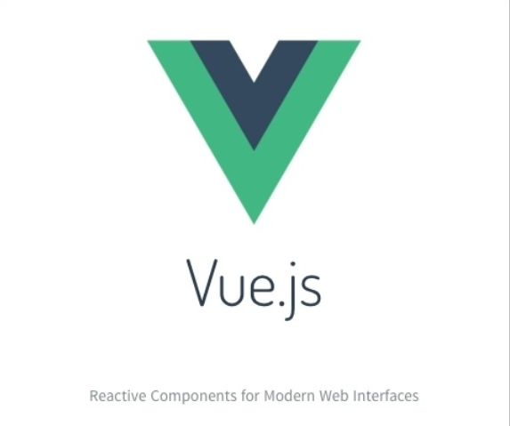

现在说 Vue.js 是一款渐进式 JavaScript 框架：

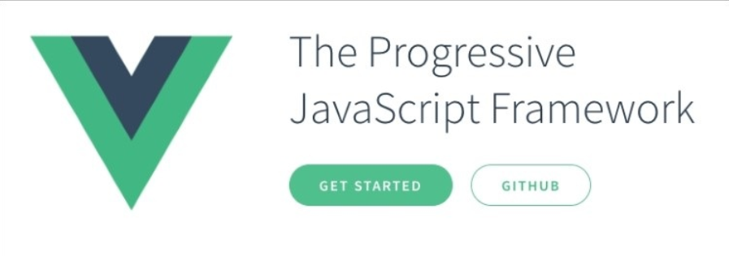

所以 Vue.js 到底是个啥？ 框架？ 工具？ 库？ 它能被用于构建全栈 web 方程式吗？ 还是只能添加一些特殊的功能？ 我应该从我最喜欢的框架切换过来吗？ 如果是， 又是为什么？ 我可以在项目中单独使用它吗？ 它能带来什么优势呢？

在本章， 我们将试着发现这些问题的答案。 我们将在一些简单的事例里初试 Vue.js 。

更多内容如下列表：

* 学习 Vue.js 到底是什么， 它重要的部分及其的历史
* 学习哪些项目使用 Vue.js
* 用 Vue.js 构建一个简单的购物清单并用 jQuery 完成相应的方程式
* 用 Vue.js 构建番茄钟
* 做一点简单的练习

## Vue.js 历史

当时 Evan You， Vue.js 的创建者 ( http://evanyou.me/ )， 在 Google Creative 实验室搞一个项目， 它们需要一款制作快速原型而不是大的 UI 界面。 书写大量重复的 HTML 是很耗时耗资源的， 所以 Evan 开始寻找一些已有的工具。 出乎意料的是， 这里没有一款工具， 库， 或是框架可以很好地制作快速原型！ 在那时， Angular 被广泛使用， React.js 才刚刚起步， 例如 Backbone.js 的 MVC 框架被用于大型方程式。 对于这种需要弹性及轻量级的快速原型项目来说， 这些复杂的框架无法胜任。

当你意识到这些东东很酷且不存在时， 你可能自己动手创造它 -- just do it！

### 注意

Vue.js 以制作快速原型工具的身份诞生。 现在它可悲用于构建复杂大规模响应式 web 方程式。

这就是 Evan 所做的。 这就是他想出创造一个库通过简单， 弹性的响应式数据和可重用组件的方式帮助制造快速原型的事。

就像每个库一样， Vue.js 也不断成长发展， 因此提供了越来越多的功能。 现在， 它提供了一种简单的方式来添加创建插件， 书写和使用混入， 为整体添加自定义行为。 Vue 可以像框架一样以弹性灵活的方式构建 web 方程式。

## 关于 Vue.js 最重要的事

Vue.js 允许你简单绑定你的数据模型给呈现层。 它也允许你在整个方程式内简单地重用组件。

在这你不需要创建特殊的模型或者集合来注册事件对象。 你不需要遵循一些特别的语法。 你不需要安装无止境的依赖。

你的模型是原生 JavaScript 对象。 它们可以被绑定给任意视图(text， inputtext， classes， attributes 等)。

你可以简单地添加 *vue.js* 到你的项目内并使用它。 你还可以使用 *vue-cli* 及 Webpack 和 Browserify 来启动整个项目, 它支持热重载并提供开发者工具。

## 我们去采购！

我知道你的周末又近了， 你想去杂货店为下周采购一些东东。 除非你记忆力超群， 否则在出发前你一定需要一个购物清单。 你可能已经在使用了一些方程式来这样做了， 但我们为啥不自己也做一个呢？ 你觉得我们自己创建设计一个购物清单方程式怎么样？ 还等啥， 我们动手吧！ 我们来创建自己的购物清单方程式。 这非常简单只需为购物清单构建交互原型。

这个方程式允许我们增加删除选项并展示我们的购物列表。 实际上呢， 这个 ToDo 列表有点像。 我们以经典的 HTML + CSS + JS + jQuery 来实现它。 我们将使用 Bootstrap 框架来添加一些赏心悦目的样式。

## 用 jQuery 实现一个购物清单

你的代码可能就像下面的：

```html
<div class="container">
    <h2>My Shopping List</h2>
    <div class="input-group">
        <input placeholder="add shopping list item" type="text" class="js-new-item form-control">
        <span class="input-group-btn">
          <button @click="addItem" class="js-add btn btn-default"
          type="button">Add!</button>
        </span>
    </div>
    <ul>
        <li>
            <div class="checkbox">
                <label>
                  <input class="js-item" name="list"
                  type="checkbox"> Carrot
                </label>
            </div>
        </li>
        <li>
            <div class="checkbox">
                <label>
                  <input class="js-item" name="list" type="checkbox"> Book
                </label>
            </div>
        </li>
        <li class="removed">
            <div class="checkbox">
                <label>
                  <input class="js-item" name="list" type="checkbox"
                  checked> Gift for aunt's birthday
                </label>
            </div>
        </li>
    </ul>
</div>
```

然后是 CSS 代码：

```css
.container {
  width: 40%;
  margin: 20px auto 0px auto;
}
.removed {
  color: gray;
}
.removed label {
  text-decoration: line-through;
}
ul li {
  list-style-type: none;
}
```

最后是 JavaScript/jQuery 代码：

```javascript
$(document).ready(function () {
  /**
  * Add button click handler
  */
  function onAdd() {
    var $ul, li, $li, $label, $div, value;

    value = $('.js-new-item').val();
    //validate against empty values
    if (value === '') {
      return;
    }

    $ul = $('ul');
    $li = $('<li>').appendTo($ul);
    $div = $('<div>')
          .addClass('checkbox')
          .appendTo($li);
    $label = $('<label>').appendTo($div);

    $('<input>')
      .attr('type', 'checkbox')
      .addClass('item')
      .attr('name', 'list')
      .click(toggleRemoved)
      .appendTo($label);

    $label.append(value);
    $('.js-new-item').val('');
  }

  /
  **
  * Checkbox click handler -
  * toggles class removed on li parent element
  * @param ev
  */

  function toggleRemoved(ev) {
    var $el;
    $el = $(ev.currentTarget);
    $el.closest('li').toggleClass('removed');
  }

  $('.js-add').click(onAdd);
  $('.js-item').click(toggleRemoved);
});
```

### Tip
你可以在 https://github.com/PacktPublishing/Learning-Vue.js-2 下载源码。

如果你打开浏览器， 你会看到如下图的东东：

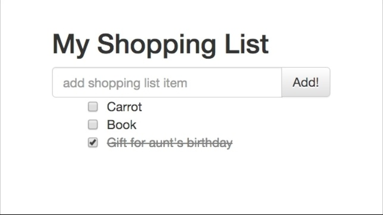

用 HTML + CSS + JS + jQuery 完成一个购物清单方程式

在 JSFiddle https://jsfiddle.net/chudaol/u5pcnLw9/2/ 查看效果。

正如你看到的， HTML 代码里包含一个无序列表， 每个项目都有一个复选框和一点文本， 一个给用户输入的输入框和 **Add!** 按钮。 每次点击 **Add!** 后， 输入的文本将转换到列表中。 点击项目的复选框时， 项目的状态被切换为已买到。

我们来增加一个可以改变清单标题的功能。

所以， 我们需要再添加一点事件监听器和控制器：

```html
<div class="container">
  <h2>My Shopping List</h2>
  <!-- ... -->
  <div class="footer">
    <hr/>
    <em>Change the title of your shopping list here</em>
    <input class="js-change-title" type="text"
    value="My Shopping List"/>
  </div>
</div>
```

```js
function onChangeTitle() {
  $('h2').text($('.js-change-title').val());
}
$('.js-change-title').keyup(onChangeTitle);
```

在 JSFiddle  https://jsfiddle.net/chudaol/47u38fvh/3/ 查看。

## 用 Vue.js 完成购物清单

这是个非常简单的事例。 我们试着用 Vue.js 一步步完成它。 这里有许多用方法引入 *vue.js*， 在本章， 我们将通过 NPM 添加 Vue 文件的方式引入：

```html
<script src="https://cdnjs.cloudflare.com/ajax/libs/vue/2.0.3/vue.js">
</script>
```

我们来渲染列表元素。

创建 HTML：

```html
<div id="app" class="container">
  <h2>{{ title }}</h2>
  <ul>
    <li>{{ items[0] }}</li>
    <li>{{ items[1] }}</li>
  </ul>
</div>
```

现在添加 JavaScript 代码：

```js
var data = {
  items: ['Bananas', 'Apples'],
  title: 'My Shopping List'
};

new Vue({
  el: '#app',
  data: data
});
```

打开浏览器， 你将看到如下列表：

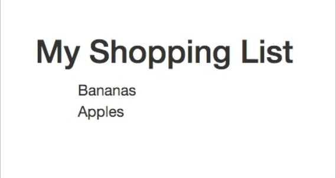

用 Vue.js 完成购物清单

我们来分析一下这个事例。 Vue 方程式以 *new Vue* 关键字开始。 我们是怎么绑定这些标记给方程式数据的呢？ 我们 *vue* 实例传入绑定的 DOM 元素而其它页面中的标记将不受 Vue 影响。

正如你所见， 我们的标记包围在 *#app* 元素内并以第一个参数传入 Vue 选项内。 *data* 参数包含着被应用于双花括号内的内容标记的对象。 如果你了解一些模板预处理器， 将会对这种语法很熟悉。

那又如何？ 你可能惊呼起来。 你要叫我啥？ 如何使用模板预处理器？ 谢谢， 手动再见！

别， 我亲爱的读者朋友， 耐心点， 我们继续来完成我们的事例。 有趣的就在后面！

## 用开发者工具分析数据绑定

我们来看看数据绑定是怎么回事。 打开你浏览器的开发者工具， 找到 JavaScript 代码， 在断点脚本前面添加一个断点。 现在分析下 *data* 对象在 Vue 初始化前后的变化。 如你所见， 变化很大。 现在 *data* 对象已经绑定为响应式数据了：

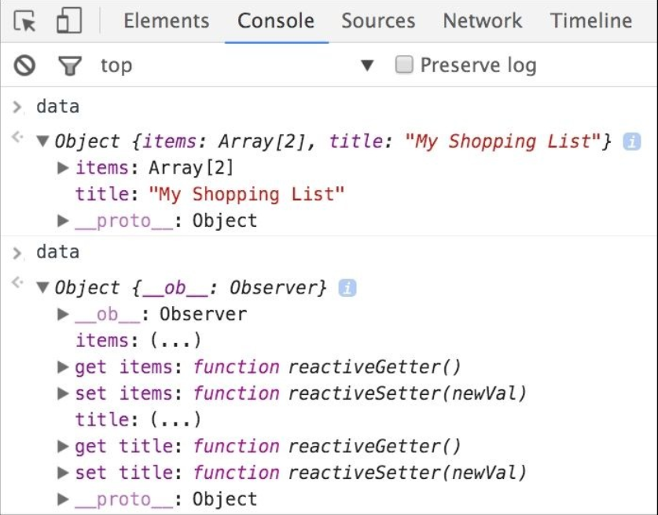

data 对象在 Vue 初始化前后的变化

现在如果我们从控制台改变了 *data* 对象的 *title* 属性， 它将自动反应到页面上：

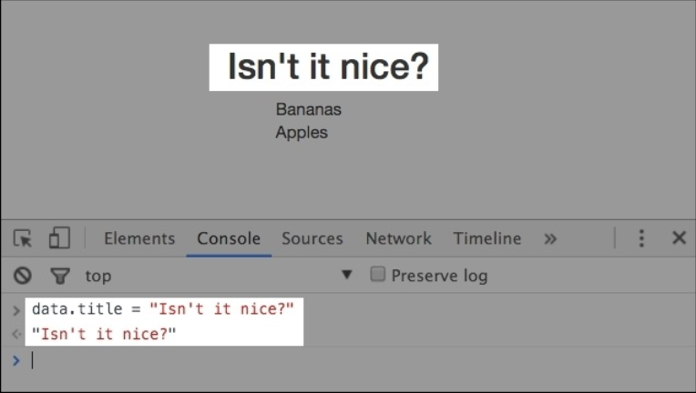

数据绑定： 变化对象的属性将迅速影响到视图上

## 用双向绑定把用户输入带给 data

所以， 在我们额事例中， 我们可以用原生的 JavaScript 数据模型传递到页面中。 我们提供了一种方程式数据通向视图的单向方式。 你不觉得如果我们提供一种双向的数据绑定会更好吗？

我们现在就看看怎么实现双向的数据绑定， 怎样在页面上改变 *data* 的属性值。

为标题拷贝 HTML 标记， 改变在第一个 jQuery 事例中的输入， 在 input 上添加 *v-model="title"* 的特性。

### Tip

你听说过 Vue.js 中的指令了吗？ 恭喜， 你已经在使用指令了！ 实际上， *v-model* 特性就是 Vue.js 用来提供双向数据绑定的指令。 你可以在 Vue 官方页面了解更多  http://vuejs.org/api/#v-model 。

现在， HTML 代码如下：

```html
<div id="app" class="container">
  <h2>{{ title }}</h2>
  <ul>
    <li>{{ items[0] }}</li>
    <li>{{ items[1] }}</li>
  </ul>
  <div class="footer">
    <hr/>
    <em>Change the title of your shopping list here</em>
    <input v-model="title"/>
  </div>
</div>
```

就这么简单！

刷新页面改变输入， 你将看到标题自动更新：

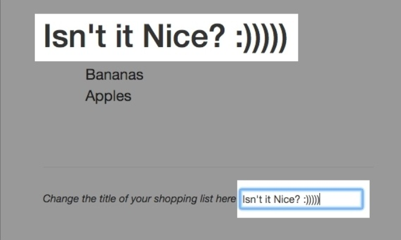

数据绑定： 改变绑定在模型属性上的文本将影响绑定的相同属性

很棒吧； 但是这个事例仅仅有两个列表项。 我们需要渲染更多的列表项。

## 用 v-for 指令渲染更多的列表项

我们需要一种机制来遍历 *items* 数组并在 *<ul>* 中渲染每一个列表项。

幸运的是， Vue.js 提供一种很棒的指令来做这件事。 它就是 *v-for*。 我们将在 *<li>* 上使用它。 修改我们的标记：

```html
<ul>
  <li v-for="item in items">{{ item }}</li>
</ul>
```

### 注意

你将会学到更多的新指令例如 *v-if, v-else, v-show, v-on, v-bind* 等。

刷新页面查看。 页面没有变化。 试着在控制台往 *items* 数组内添加列表项， 列表变化了：

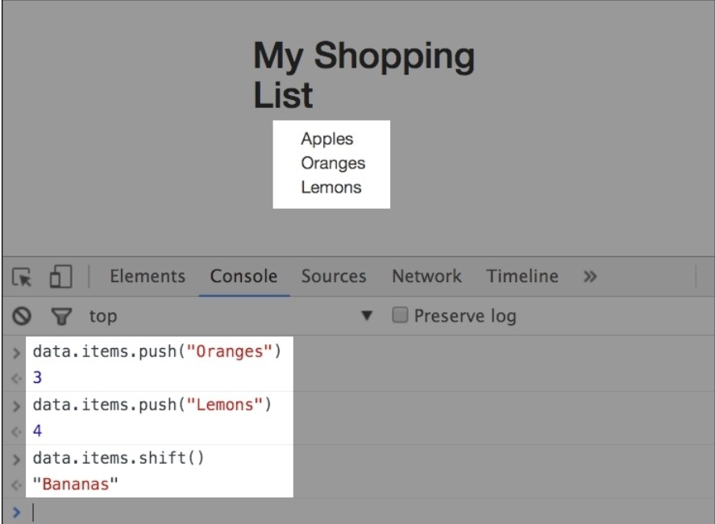

数据绑定： 改变数组迅速影响列表

现在， 我们用一行标记就有了整个列表。 但是我们还需要一个允许我们切换购买状态的复选框。

## 切换列表项的状态

为了达到这个目的， 我们稍微改变我们的 *items* 数组：

```js
var data = {
  items: [{ text: 'Bananas', checked: true },
          { text: 'Apples', checked: false }],
  title: 'My Shopping List',
  newItem: ''
};
```

我们的标记看起来时这样的：

```html
<ul>
  <li v-for="item in items" v-bind:class="{ 'removed':
  item.checked }">
    <div class="checkbox">
      <label>
        <input type="checkbox" v-model="item.checked"> {{
        item.text }}
      </label>
    </div>
  </li>
</ul>
```

刷新页面查看 *items* 的 *checked* 属性， 观察效果。 每个 *<li>* 的状态都被绑定到复选框的布尔值上了。

## 使用 v-on 指令添加新的购物清单

现在， 我们需要改造一下我们的的购物清单。 我们需要添加更多的对象给 *data* 对象， 叫它 *newItem* 吧。 我们也可以添加一个方法来把它加到 *items* 数组里。 我们需要 *v-on* 指令来通过点击事件调用添加方法。

我们的 JavaScript 如下：

```js

var data = {
  items: [{ text: 'Bananas', checked: true },
          { text: 'Apples', checked: false }],
  title: 'My Shopping List',
  newItem: ''
};

new Vue({
  el: '#app',
  data: data,
  methods: {
    addItem: function () {
      var text;
      text = this.newItem.trim();
      if (text) {
        this.items.push({
          text: text,
          checked: false
        });
        this.newItem = '';
      }
    }
  }
});
```

我们为 *data* 对象添加了一个新属性叫 *newItem*。 然后我们加了一个新的 *methods* 给 Vue 初始化设置对象并添加了 *addItem* 方法。 所有的 *data* 属性都可以在 *methods* 内通过 *this* 关键字访问到。 因此， 在这个方法内， 我们取得 *this.newItem* 并添加它到 *this.items* 数组。 现在我们必须这个方法的调用绑定到用户操作上。 就像前面提及的， 我们将使用 *v-on* 指令并应用 *enter* 键盘事件给 **Add!** 点击按钮。

我们的标记是这样的：

```html
<div class="input-group">
  <input v-model="newItem" v-on:keyup.enter="addItem"
  placeholder="add shopping list item" type="text" class="formcontrol">
  <span class="input-group-btn">
    <button v-on:click="addItem" class="btn btn-default"type="button">Add!</button>
  </span>
</div>
```

### 注意
*v-on* 指令附加一个事件监听器给元素。 缩写为 *@* 标志。 所以 *v-on:keyup="addItem"* 等于 *@:keyup="addItem"* 。 阅读更多 *v-on* 指令信息 http://vuejs.org/api/#v-on。

整个代码如下：

```html
<div id="app" class="container">
  <h2>{{ title }}</h2>
  <div class="input-group">
    <input v-model="newItem" @keyup.enter="addItem"
    placeholder="add shopping list item" type="text"
    class="form-control">
    <span class="input-group-btn">
    <button @click="addItem" class="btn btn-default"
    type="button">Add!</button>
    </span>
  </div>

  <ul>
    <li v-for="item in items" :class="{ 'removed': item.checked}">
      <div class="checkbox">
      <label>
        <input type="checkbox" v-model="item.checked"> {{
        item.text }}
      </label>
      </div>
    </li>
  </ul>

  <div class="footer hidden">
    <hr/>
    <em>Change the title of your shopping list here</em>
    <input v-model="title"/>
  </div>
</div>
```

JavaScript 代码如下：

```js
var data = {
  items: [{ text: 'Bananas', checked: true },
          { text: 'Apples', checked: false }],
  title: 'My Shopping List',
  newItem: ''
};

new Vue({
  el: '#app',data: data,
  methods: {
    addItem: function () {
      var text;
      text = this.newItem.trim();
      if (text) {
        this.items.push({
          text: text,
          checked: false
        });
        this.newItem = '';
      }
    }
  }
});
```

JSFiddle： https://jsfiddle.net/chudaol/vxfkxjzk/3/。


## 在已有的项目中使用 Vue.js

我知道你现在感觉绑定模型属性给视图是多么容易， 你看是思考如何在你的项目内使用它了。 但是你可能会觉得使用 Vue.js 很麻烦需要安装一堆文件。

在这我告诉你： 完全不需要！ 不需要任何安装， 仅仅引入 *vue.js* 文件就可以了。 就这么简单。

## Vue.js 2.0!

写作此书时， Vue.js 2.0 发布了 https://vuejs.org/2016/04/27/announcing-2.0/ 。 更多内容：

* http://www.infoworld.com/article/3063615/javascript/vuejs-lead-our-javascriptframework-is-faster-than-react.html
*  https://www.reddit.com/r/vuejs/comments/4gq2r1/announcing_vuejs_20/

第二版的 Vue.js 比前前面的版本有了很大的变化， 数据绑定的方式变化了并被写入 API。 运用轻量级的虚拟 DOM 来进行渲染， 支持服务端渲染， 更快更精简。

写作此书时， Vue 2.0 还是 alpha 阶段。 别担心， 尽管如此，我们在本书中所有的事例都将基于最新稳定版的 Vue 2.0， 并完全支持这两个版本。

## 使用 Vue.js 的项目

你可能现在想知道有哪些项目是基于 Vue.js 构建的， 或是作为它们代码基的一部分。 这里有很多开源， 试验性质的和企业项目在使用 Vue.js。 可以在这里找到 https://github.com/vuejs/awesome-vue#projects-using-vuejs 。


## 本书地图

这本书就像大多数技术书籍一样， 以一种你不需要从一而读的方式组织。 你可以选择你感兴趣的章节并跳过剩下的。

本书组织结构如下：
* 第二章， 基础 -- 安装使用， 理论性的知识， 将解释 Vue.js 背后的机制及主要组成部分。 所以， 你对理论不感冒可以跳过本章。 本章我们将经过安装使用和启动步骤。
* 从第三章至第八章， 我们将以构建方程式的方式来浏览 Vue.js 主要功能：
 * 在第三章， 组件 -- 理解与使用， 我们将介绍 Vue 组件并在我们的方程式内应用。
 * 在第四章， 响应式 -- 为你的方程式绑定数据， 我们将使用 Vue 提供的所有数据绑定机制。
 * 在第五章， Vuex -- 在方程式内管理状态， 我们将介绍 Vuex 状态管理系统并解释如何在我们的方程式内使用
 * 在第六章， 插件 -- 自己动手，丰衣足食， 我们将学习如何为 Vue 方程式通过创建使用插件来添加功能。
 * 在第七章， 测试 -- 测试我们所做的一切， 我们将覆盖并浏览 Vue.js 的自定义指令并我们的方程式创建一些指令。
 * 在第八章， 部署 -- 上线！， 我们将学习如何测试并部署我们的 Vue.js 方程式
* 在第九章， 下一步？， 我们将总结我们所学并看看我们还需要做哪些。

## 我们来管理时间！

此时， 我已经知道你已经迫不及待地想通读此书了。 这样可不好， 我们需要管理我们的时间， 劳逸结合。 所以我们来创建一个简单的方程式来实现番茄工作法。

### 注意
番茄工作法是一款事件管理技术以厨房番茄计时器。 这种技术以把工作时间打碎为小块的工作时段而组成。 更多番茄工作法信息： http://pomodorotechnique.com/ 。

因此， 我们的目的非常简单。 我们仅仅需要创建一个非常简单的时间计时器， 它将不断递减计时器来轮换工作时间和休息时间。

我们动手吧！

我们将引入两个 Vue data 变量， *minute， second*， 显示到我们的页面上。 秒数持续递减直到递减为零时， 分数递减； 当秒数和分数都为零时， 方程式切换工作时间与休息时间：

```js
const POMODORO_STATES = {
  WORK: 'work',
  REST: 'rest'
};
const WORKING_TIME_LENGTH_IN_MINUTES = 25;
const RESTING_TIME_LENGTH_IN_MINUTES = 5;

new Vue({
  el: '#app',
  data: {
    minute: WORKING_TIME_LENGTH_IN_MINUTES,
    second: 0,
    pomodoroState: POMODORO_STATES.WORK,
    timestamp: 0
  },
  methods: {
    start: function () {
      this._tick();
      this.interval = setInterval(this._tick, 1000);
    },

    _tick: function () {
      //if second is not 0, just decrement second
      if (this.second !== 0) {
        this.second--;
        return;
      }
      //if second is 0 and minute is not 0,
      //decrement minute and set second to 59
      if (this.minute !== 0) {
        this.minute--;
        this.second = 59;
        return;
      }
      //if second is 0 and minute is 0,
      //toggle working/resting intervals
      this.pomodoroState = this.pomodoroState ===
      POMODORO_STATES.WORK ? POMODORO_STATES.REST :
      POMODORO_STATES.WORK;

      if (this.pomodoroState === POMODORO_STATES.WORK) {
        this.minute = WORKING_TIME_LENGTH_IN_MINUTES;
      } else {
        this.minute = RESTING_TIME_LENGTH_IN_MINUTES;
      }
    }
  }
});
```

在我们的 HTML 代码中， 我们为 *minute* 和 *second* 创建两个占位符， 和一个番茄钟的开始按钮：

```html
<div id="app" class="container">
  <h2>
    <span>Pomodoro</span>
    <button @click="start()">
    <i class="glyphicon glyphicon-play"></i>
    </button>
  </h2>
  <div class="well">
    <div class="pomodoro-timer">
      <span>{{ minute }}</span>:<span>{{ second }}</span>
    </div>
  </div>
</div>
```

我们依然使用 Bootstrap 作为样式库， 我们的番茄钟是这样的：


用 Vue.js 构建的计时器

我们的番茄钟很棒， 但有一些问题：
* 首先， 我们不清楚哪个状态被切换了。 我们不知道我们是否该工作还是该休息。 我们来引入一个标题来指示番茄钟的状态。
* 另一个问题是分钟和秒钟不一致的显示。 例如， 24 分 5 秒应该显示为 24：05 而非 24：5。 我们来用计算值修复这个问题。
* 还有一个问题是我们的开始按钮可以被多次点击， 每次点击后都会重启计时器。 我们来修复这个问题。 通过引入开始， 暂停， 停止按钮来控制方程式的状态。

## 使用计算属性切换标题

我们用计算属性来修复第一个问题。

### 注意
计算属性是在 *data* 对象内允许我们避免用额外的逻辑过度扰乱模板的属性。 你可以在在 Vue 的官方站点找到更多信息：  http://vuejs.org/guide/computed.html 。

在 Vue 的配置对象内添加计算部分和标题属性：

```js
data: {
  //...
},
computed: {
  title: function () {
    return this.pomodoroState === POMODORO_STATES.WORK ? 'Work!' :
    'Rest!'
  }
},
methods: {
  //......
}
```

现在在标记内使用 Vue data 属性：

```html
<h2>
  <span>Pomodoro</span>
  <!- -!>
</h2>
<h3>{{ title }}</h3>
<div class="well">
```

好棒！ 现在我们有了在番茄钟状态变化时自动变化的标题了：

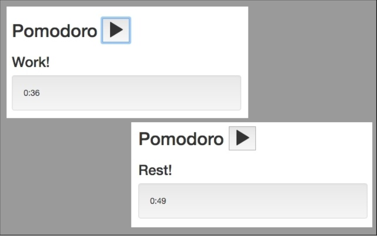

基于计时器状态自动更新的标题

很棒吧！

## 使用计算属性制造左间距

现在解决第二个问题。 我们添加两个计算属性， *min* 和 *sec*， 在 *data* 选项的计算部分并运用简单的算法在零的左边制造一个边距。 当然， 我们我们可以使用一个非常著名的项目 ( https://github.com/stevemao/left-pad)， 但是为了更简单并不破坏整个互联网 ( http://www.theregister.co.uk/2016/03/23/npm_left_pad_chaos/)， 我们自己添加一个简单的逻辑：

```js
computed: {
  title: function () {
    return this.pomodoroState === POMODORO_STATES.WORK ? 'Work!' :
    'Rest!'
  },
  min: function () {
    if (this.minute < 10) {
      return '0' + this.minute;
    }
    return this.minute;
  },
  sec: function () {
    if (this.second < 10) {
      return '0' + this.second;
    }
    return this.second;
  }
}
```

并在 HTML 内使用这些属性值：

```html
<div class="pomodoro-timer">
  <span>{{ min }}</span>:<span>{{ sec }}</span>
</div>
```

刷新页面查看效果：

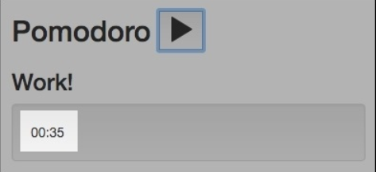

在 Vue.js 用计算属性制造左边距

## 用开始， 暂停， 停止按钮保持状态

所以呢， 现在来修复第三个问题， 我们引入三个方程式状态， *started, paused, stopped*， 我们来创建三个方法来切换这个三个状态。 我们已经拥有了开始方法， 所以我们只需要添加一点逻辑调整状态到 *started*。 我们也添加两个额外的方法， *pause, stop*， 它们将改变番茄钟对应的状态：

```js
const POMODORO_STATES = {
  WORK: 'work',
  REST: 'rest'
};
const STATES = {
  STARTED: 'started',
  STOPPED: 'stopped',
  PAUSED: 'paused'
};
//<...>
new Vue({
  el: '#app',
  data: {
    state: STATES.STOPPED,
    //<...>
  },
  //<...>
  methods: {
    start: function () {
      this.state = STATES.STARTED;
      this._tick();
      this.interval = setInterval(this._tick, 1000);
    },

    pause: function () {
      this.state = STATES.PAUSED;
      clearInterval(this.interval);
    },

    stop: function () {
      this.state = STATES.STOPPED;
      clearInterval(this.interval);
      this.pomodoroState = POMODORO_STATES.WORK;
      this.minute = WORKING_TIME_LENGTH_IN_MINUTES;
      this.second = 0;
    },
    //<...>
  }
});
```

在我们的 HTML 内添加两个按钮并为添加 *click* 监听器， 调用相应的方法：

```html
<button :disabled="state==='started'"
@click="start()">
  <i class="glyphicon glyphicon-play"></i>
</button>
<button :disabled="state!=='started'"@click="pause()">
  <i class="glyphicon glyphicon-pause"></i>
</button>
<button :disabled="state!=='started' && state !== 'paused'"
@click="stop()">
  <i class="glyphicon glyphicon-stop"></i>
</button>
```

现在我们的方程式看起来是这样的：

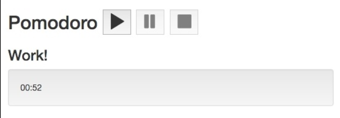

根据方程式的状态切换开始， 暂停， 停止按钮

在 JSFiddle 查看效果 https://jsfiddle.net/chudaol/b6vmtzq1/1/

做了这么多工作后， 你应该好好休息一下了， 这里有很多可爱的小猫， 来看看吧(●'◡'●) http://thecatapi.com/：

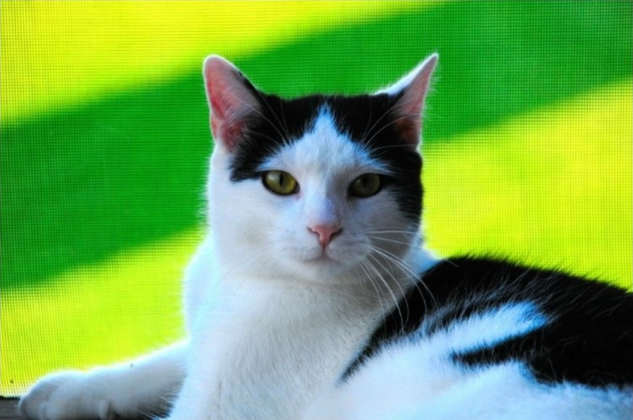

## 练习

在本章的最后， 我将布置一个小练习。 我们在前面构建的番茄钟毫无疑问是很棒的， 但是依旧缺乏一些功能。 一个非常棒的功能就是从 http://thecatapi.com/ 在休息状态下显示一只小猫。 你能实现吗？ 当然， 你可以的！ 但别被小猫萌翻哦(●'◡'●)。

## 总结

我非常高兴你看到这里了， 这意味着你已经知道 Vue.js 是什么， 如果有人问你它是一个工具还是库还是框架时， 你可以准确地找出答案。 你也知道如何用 Vue.js 来启动一个方程式并在已有的项目内使用 Vue 的功能。 你看了那些用 Vue.js 写的项目并开始开发一个自己的项目！ 现在你在采购时有了一个自己用 Vue.js 创建的购物清单方程式了！ 也有了自己的番茄钟。 还有最重要的是， 你可以在番茄钟内放入一只随机的猫咪了(>^ω^<)。

在下一章， 我们将探究 Vue 的幕后， 它是如何运作的， 它的使用的架构模式又是怎样的。 对于事例中的每个概念我们将以 demo 的形式来演示它。 然后我们将准备深入代码并完善我们的方程式， 让它们变得更棒。
