# Fundamentals – Installing and Using
在前一章， 我们熟悉了 Vue.js 。我们已经在两个不同的程序中使用了它。 我们学习了如何在项目中应用 Vue.js。 我们实践了响应式数据绑定。

现在， 你可能会问自己： Vue 是怎样运作的？ 它又是如何在数据模型变化时快速响应 UI 变化的？ 你可能决定在项目中使用它， 想知道用不用遵循一些架构模式或者范例。 在本章我们将探索这些关键的概念， 理解隐藏在 Vue.js 背后的特性。 我们将分析所有安装 Vue.js 的方法， 同时为我们的方程式创建一个骨架， 然后在后续章节中不断地增强改进。 我们也会学习调试、 测试我们的方程式。

所以呢， 在本章，我们将学习如下内容：
* 什么是 MVVM 架构， 在 Vue.js 中如何体现
* 什么是声明式视图
* Vue.js 如何定义属性， getters、 setters
* 响应式和数据绑定如何运作
* 什么是脏检查机制、 DOM、 虚拟 DOM
* Vue.js 1.0 和 2.0 的区别
* 什么是可重用的组件
* 插件、 指令、 自定义插件、 自定义指令如何在 Vue.js 中运作
* 如何安装、 运行、 调试 Vue 方程式

## MVVM 架构模式
你还记得我们是怎么创建 Vue 实例的吗？ 我们以关键字 new Vue({...}) 来创建实例。 你一定记得在配置项中， 我们可以把 data 对象传递给绑定的元素。 data 对象是我们的模型， 而 DOM 元素是 Vue 实例绑定的地方。


Vue 中的经典视图模型事例

同时， 我们的 Vue 实例帮助我们把模型绑定到视图中， 反之亦然。 我们的方程式因此遵循着 Model-View-ViewModel(MVVM) 模式。


Model-View-ViewModel 模式简化图

我们的模型包含数据和一些基本逻辑， 视图对之响应。 视图模型控制数据绑定， 保证在模型数据的变化会迅速反应在视图中， 反之亦然。

我们的视图因此完全是数据驱动的。 视图模型响应了对数据流的控制， 这样数据绑定的声明才管用。

## 定义属性， getters、 setters
数据一旦传入 Vue 实例后将发生什么呢？ 为什么这些被 Vue 应用的转换会自动地绑定到视图呢？

我们来分析一下我们需要做什么， 我是说， 每当我们需要给一个字符串应用一些变化给 DOM 元素时，我们该怎样应用这个监听函数？ 在 *var stringVar = 'hello' ; stringVar.onchange(doSomething)* 中有太多的工作要做。

我们可以包装字符串的值， 设置一些 setting 或者 getting 函数， 当每次更新字符串的时候， DOM 也随之更新。 你会怎样实现这个功能呢？ 当你思考这个问题时， 我将准备一些有趣而简短的例子。

在你的购物清单方程式中打开你的开发者工具， 写下如下代码：

```js
var obj = {};
var text = '';
```

将我们 DOM 元素赋值给 h2

```js
var h2 = document.getElementsByTagName('h2')[0];
```

如果我们把 *text* 的值赋给 *obj.text* 属性， 我们怎样才能追踪 *h2* 中每一次的属性变化呢？

我们可以使用 *Object.defineProperty* 方法(https://developer.mozilla.org/en/docs/Web/JavaScript/Reference/Global_Objects/Object/define)。

这个方法允许我们创建一个 *getter、 setter* 函数， 因此可以获取这些属性的变化。

```js
Object.defineProperty(obj, 'text', {
  get: function ()　{
    retuen text;
  }
  set: function (newVal) {
    text = newVal;
    h2.innerHTML = text;
  }
});
```

现在在控制台改变 *obj.text* 的属性， 观察标题

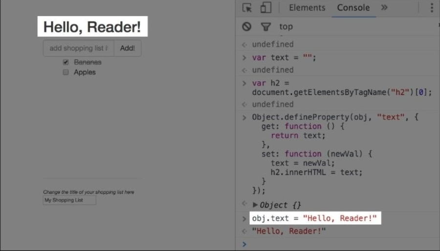
object.defineProperty 在每次属性变化时被调用

Vue.js 就是应用了这个机制。 当数据被传入到 Vue 实例中时， 它的所有属性都将通过 *object.defineProperty* 方法。 在页面中的每个指令，都被安排了一个 *set* 方法。 打开 *vue.js* 文件并搜索 *set: function reactiveSetter(newVal)* 。增加一个断点并调试购物列表的输入， 直到找到在函数中最后一个叫 *dep.notify()* 的调用：

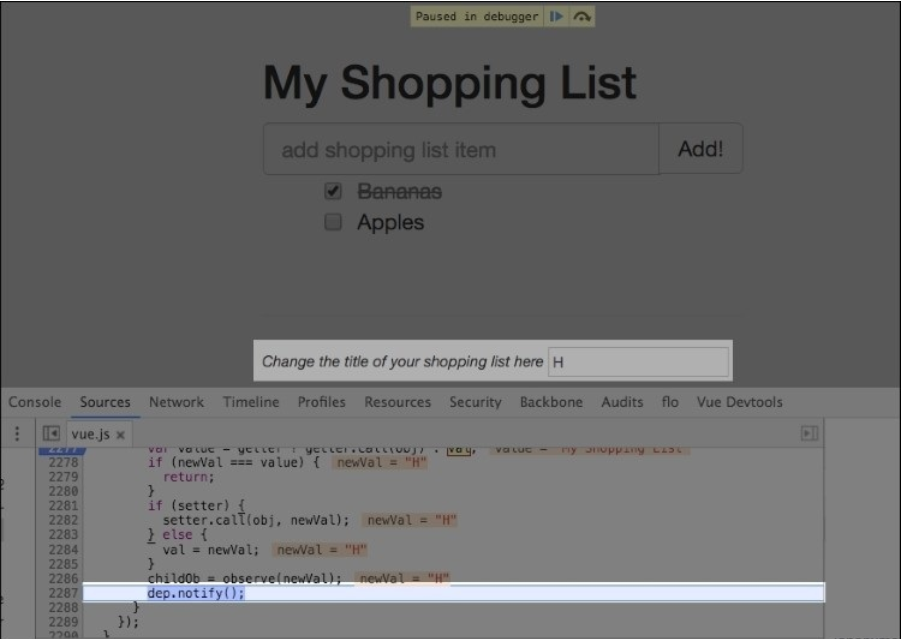
在 setter 函数中调用观察方法处的断点

在这个函数中， 你可以看到它正在遍历每一个属性的观察器， 并更新它们。 如果你跳过这个调用， 你将不会看到 DOM 的更新。 因为更新上执行的事件轮询被放在了一个定期执行的队列里。

找到 *runBatcherQueue* 函数， 并放入断点。 再次尝试改变标题的值。 如你所见， 这个函数将遍历正在队列里等待的观察器， 然后调用它们的 *run* 方法。 观察这个方法， 你可以看到它在比较新值和旧值。

```js
if (value !== this.value || ...)
```

然后会启动一个回掉

```js
this.cb.call(this.vm, value, oldValue);
```

如果你再仔细研究一个这个回掉函数， 你会发现它会在最后更新 DOM 值。

```
update: function update(value) {
  this.el[this.attr] = _toString(value);
}
```

很简单不是吗！

### 注意
在这里用的是 Vue.js 1.0版本。

所以呢， Vue.js 的响应式机制非常简单。 观察器被赋到所有指令和数据属性上， 然后在 *Object.defineProperty* 的 *set* 方法上， 依次通知更新每个 DOM 或数据。

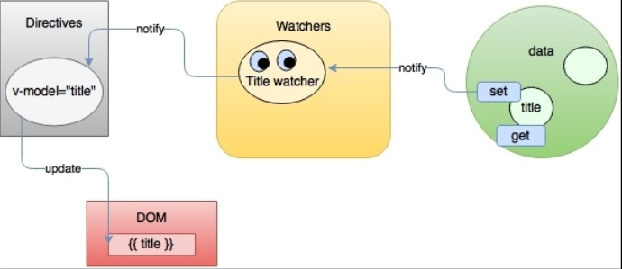

数据对象到 DOM 间的数据流

那些拥有指令的 **DOM** 元素都被附着上了监听器， 来依次通知更新每次调用的数据值。

## 和其他框架的比较

当你尝试一个新工具时， 你一定想和其它工具或框架相比较一下。 你可以在 Vue.js 的官方页面找到一些深度地比较： http://vuejs.org/guide/comparison.html 。 在这些框架中我将在这里列出一些我认为重要的说明。


### React
React 和 Vue 很像。 他们都使用了虚拟 DOM ， 拥有可重用的组件， 响应式数据。 它值得一提， 但是， Vue 从 2.0 才开始使用虚拟 DOM。 2.0 之前它使用的是真实 DOM。 2.0 版本性能远超 1.0 同时也超过 React ( http://vuejs.org/guide/comparison.html#Performance-Profiles )。

两个框架最大的差别在于使用组件的方式。 你可能已经知道， 在 React 中所有一切都是 JavaScript。 用 JavaScript 开发所有的东东， 甚至是模板， 方程式一直在相同的作用域里，渲染便得非常有弹性。

但是， 一些需要快速原型的初级设计者， 或者是那些不想学习 JSX 的人来说， 这真是个痛点。 在 Vue 组件中， 你也可以使用 JSX， 也可以使用一般的 web 开发结构： 在 style 标签中写 CSS， 在 template 中写 HTML，在 script 标签中写 JavaScript 。 例如比较在 React 中写的渲染函数和在 Vue 组件的模板， 我将展示一个简单的事例来说明这些不同：


```js
render () {
  return (
    <ul>
    {items.map(item =>
      <li className={item.checked && 'removed'}>
        <div className='checkbox'>
          <input type='checkbox' checked={item.checked}>
          { item.text}
        </div>
      </li>
      )}
    </ul>
  )
}
```

使用 Vue , 你只需写一些 HTML 代码在 *template* 标签中：

```html
<template>
  <ul>
   <li v-for="item in items" :class="{ 'removed': item.checked }">
     <div class="checkbox">
     <label>
      <input type="checkbox" v-model="item.checked">{{ item.text }}
     </label>
     </div>
     </li>
  </ul>
</template>
```

我个人喜欢把这些东西都分离开， 因此我发现 Vue 这种方式更对口。

另一件很棒的事是 Vue 允许你在组件中使用带有作用域的样式， 只需要在 *style* 标签加上 scoped 属性。

```html
<style scoped>
</style>
```

有了这个样式， 当你使用预处理器时，你可以在所在组件定义全局变量并创建或重定义样式。

值得一提的还有两个框架的学习曲线。 学习 React 你可能需要学习 JSX 和 ES2015 的语法， 因为大多数 React的官方事例都在用。 学习 Vue 你完全不需要这些， 就像使用 jQuery 一样，使用 Vue 模型和数据绑定非常简单。 然后选择对你有用的部分就行。

如果你想再深入地比较两个框架， 去看看文档， 精心制作相似的事例， 再看看哪个框架适合你。

### Angular
Angular 1 和 Angular 2 差别很大。 Angular 2 和 Angular 1 完全不一样。 它拥有更好的表现， API 不同了， 底层实现也被重写了。

这两个版本是如此不同以至于在 Vue 的官方文档中分别对这两个框架进行了比较。 但是横向对比这两个版本的 Angular ，你会发现 Vue 比它们更加友好。 对比 Angular 和 Vue 的 hello world 方程式 (https://angular.io/docs/js/latest/quickstart.html )
(http://vuejs.org/guide/index.html#HelloWorld)

> "即使没有 TypeScript, Angular 的快速指南也需要 ES2015， 18个 NPM 依赖， 4个文件， 3000多行代码来输出 Hello World."

--http://vuejs.org/guide/comparison.html#Learning-Curve

如果你依然在使用 Angular 1, 值得一提的差别在于 Angular 的脏检查机制， 在存在大量观察器时， Angular 性能会明显下降， 而 Vue 只会重解析变化属性的观察器， 其它观察器不会变化。

### Vue
我没写错， 这也值得比较。 Vue 最近已经升级到了更快更轻的第二版， 如果你还在用第一版， 绝对值得升级。 你可以在这里查看 2016 年 4 月份发布的相关信息  https://vuejs.org/2016/04/27/announcing-2.0/


## Vue.js 基础

在开始编码之前，让我们来回顾一下 Vue 的特性。 分析下什么是可重用的组件， 如何控制方程式的状态， 谈谈插件， 过滤器， 混入。 在这一部分， 我们将稍微浏览一下这些特性。 后面再深入学习。

### 可重用的组件
既然你知道如何使用数据绑定， 也知道它如何运转， 是时候介绍另一项杀手级功能了。 Vue.js 创建的组件可以像盖房的砖块一样重用。 每个组件都拥有自己属于自己的样式和模板， 完全独立于其它组件。

创建组件的语法和创建 Vue 实例的语法很相似，你应该使用 *Vue.extend* 而非 *Vue* ：

```js
var customComponent = Vue.extend({...})
```

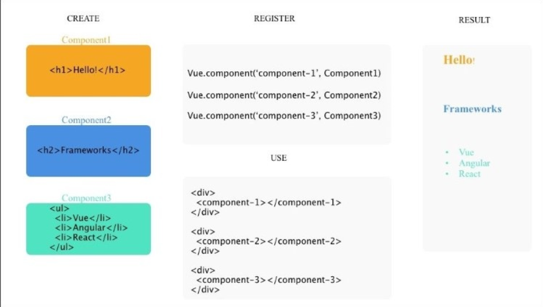

Vue.js 中的自定义组件

例如，把我们的购物列表拆分成组件。 如你所知， 我们的购物列表有三个基本部分： 列表项， 输入项， 标题变更项：

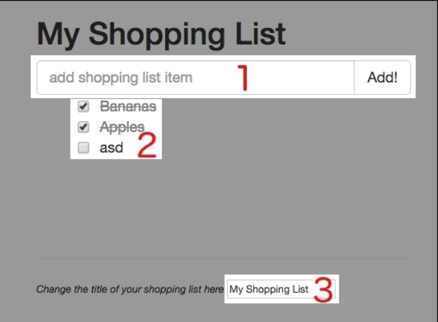

我们购物清单方程式的三个基本部分

我们可以把三个基本部分变为组件

```js
var data ={
  items: [{text: 'Bananas', checked: true},
          {text: 'Apples', checked: false}
  ],
  title: 'My Shopping List',
  newItem: ''
};
new Vue({
  el: '#app',
  data: data,
  methods: {
    addItem: function () {
      var text;
      text = this.newItem.trim();
      if(text) {
        this.items.push({
          text: text,
          checked: false
          });
          this.newItem = '';
      }
    }
  }
  });
```

现在我们来创建三个组件： ItemsComponent, ChangeTitleComponent, AddItemComponent。 它们都需要 *data* 属性。 AddItem 方法将从主要 Vue 实例转移到 ChangeTitleComponent。 所有必需的 HTML 将从 *index.html* 转移到每个组件。 所以最后，我们的脚本就像下面这样：

```js
var data = {
  items: [{text: 'Bananas', checked: true},
          {text: 'Apples', checked: false}
  ],
  title: 'My Shopping List',
  newItem: ''
};
// Declaring components

var ItemsComponents = Vue.extend({
  data: function () {
    return data;
  },
  template: '<ul>' +
  ,            <li v-for="item in items" :class="{'removed': item.checked }">' +
  ,              <div class="checkbox">' +
  ,               <label>' +
  ,                <input type="checkbox" v-model="item.checked"> {{ item.text }}' +
  ,               </label>' +
  ,              </div>' +
  ,            </li>' +
  ,          </ul>'

  });

var ChangeTitleComponent = Vue.extend({
  data: function () {
    return data;
  },
  template: '<input v-model="title"/>'
  });

var AddItemComponent = Vue.extend({
  data: function () {
    return data;
  },
  methods: {
    addItem: function () {
      var text;
      text = this.newItem.trim();
      if(text) {
        this.newItem.push({
          text: text,
          checked: false
          });
          this.newItem = "";
      }
    }
  },
  template:
    '<div class="input-group">' +
    '<input v-model="newItem" @keyup.enter="addItem" placeholder="add shopping list item" type="text" class="form-control">' +
    '<span class="input-group-btn">' +
    ' <button @click="addItem" class="btn btn-default" type="button">Add! </button>' +
    '</span>' +
    '</div>'
  });

  // 注册 components

  Vue.component('items-component', ItemsComponents);
  Vue.component('change-title-component', ChangeTitleComponent);
  Vue.component('add-item-component', AddItemComponent);

  // 实例化  Vue

  new Vue({
    el: '#app',
    data: data
  });
```

我们需要怎样在视图中使用这些组件呢？ 我们只需用组件名替代相应的标记标签。 看起来像这样：

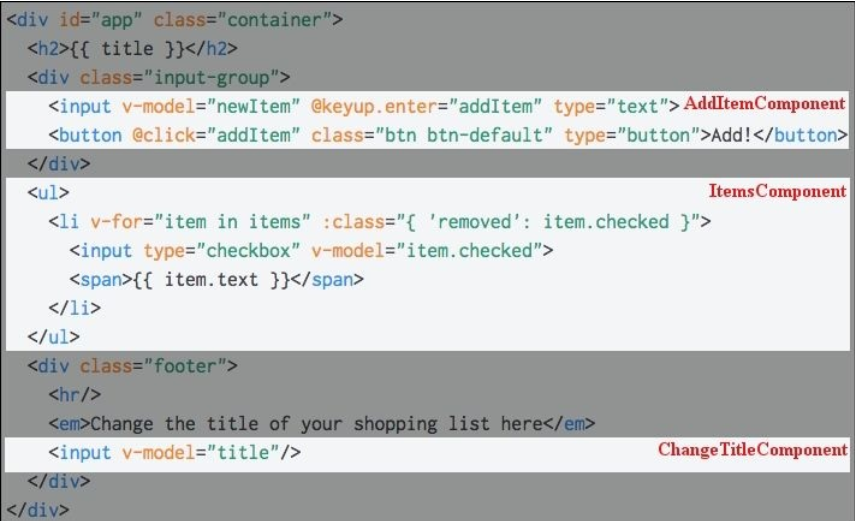

组件化的购物清单

第一个高亮区域我们将以 *<add-item-component></add-itemcomponent>*  标签来替换， 第二个拿 *<items-component></items-component>* 标签替换， 第三个拿 *<change-title-component></change-title-component>* 标签替换。 因此最终是这个样子的：

```html
<div id="app" class="container">
  <h2>{{ title }} </h2>
  <add-item-component></add-item-component>
  <items-component></items-component>
  <div class="footer">
    </hr>
    <em>Change the title of your shopping list here </em>
    <change-title-component></change-title-component>
  </div>
</div>
```

我们将在后续章节继续深入组件， 学习用更棒的方式来组织它们。

### Vue.js 指令
在前面的章节， 你已经学习了用指令来增强方程式的行为。

你已经学习了很多指令来绑定数据到视图(*v-model, v-if, v-show...* )。 在这些指令外， Vue.js 还允许你创建自己的自定义指令。 自定义指令机制允许你自定义 DOM 与 data 映射间的行为。

当注册一个自定义指令时， 你可以提供三个函数： *bind, update, unbind*。 在 *bind* 函数内， 你可以向元素附加一个事件监听器， 监听任何你需要的东东。 在 *update* 函数内， 它接收新值和旧值作为参数， 你可以在数据变化时自定义行为。 *unbind* 方法解绑所有需要解除的操作。

### Tip
在 Vue 2.0 中， 指令管的事大大减少了 -- 现在它只用于底层 DOM 操作。 Vue 也更改了先前在自定义指令上的指南 ( https://github.com/vuejs/vue/issues/2873) 。

因此呢， 全新版本的自定义指令应该是这个样子地：

```js
Vue.directive('my-directive', {
  bind: function() {
    //在绑定元素上执行一些预备工作
  },
  update: function (newValue, oldValue) {
    //基于更新值的一些操作
  },
  unbind: function () {
    //执行一些解绑操作
  }
})
```

在精简版本中， 万一你想在数据变化时搞些动作， 可以只使用 *update* 方法， 它可以直接以第二个参数的形式传入指令方程：

```
Vue.directive('my-directive', function (el, binding) {
  //对绑定值操作
})
```

理论很棒， 但是不来点实例就没意思了。 所以呢， 我们来看一个简单的例子， 当一个数字改变时， 计算它的平方。

```js
Vue.directive('square', function (el, binding) {
  el.innerHTML = Math.pow(binding.value, 2);
})
```

在你的模板中这样用哦，加上 *v-* 前缀：

```html
<div v-square="item"></div>
```

以 *item* 的值来实例化 Vue 。 你可以看到在 *div* 中的元素会立即更新。 完整代码在这里 https://jsfiddle.net/chudaol/we07oxbd/ 。

### Vue.js 中的插件

作为 Vue 的核心功能， 它提供对数据绑定的声明及组件编译。 主要通过一系列功能插件来增强。 有这么几类插件：

* 增加全局的属性或者方法(vue-element)
* 例如增加全局能力的插件(vue-touch)
* 在 Vue 属性上增加 Vue实例
* 提供一些扩展功能或 API (vue-router)

插件必须通过一个可以增强或改进的全局的 Vue 对象来提供一个实例方法。 为了更好地使用插件 Vue 使用了 *use* 方法来接收插件实例( Vue.use(SomePlugin))。

### Tip
你可以写自己的插件来使 Vue 实例拥有自定义的行为。

我们这就以前面的自定义指令来创建一个简化版的插件吧。 创建一个叫 *VueMathPlugin.js* 的文件，然后这样写哦：

```js
export default {
  install: function (Vue) {
    Vue.directive('square', function (el, binding) {
      el.innerHTML = Math.pow(binding.value, 2);
      });
    Vue.directive('sqrt', function (el, binding) {
      el.innerHTML = Math.sqrt(binding.value);
      });
  }
};
```
现在我们创建一个 *script.js* 文件。 加点代码。 在这个脚本中， 我们将导入 Vue 实例和 VueMathPlugin , 使用 *use* 方法来引用插件。

```js
import Vue form 'vue/dist/vue.js';
import VueMathPlugin from './VueMathPlugin.js'

Vue.use(VueMathPlugin);

new Vue({
  el: '#app',
  data: {item: 49}
});
```

现在创建一个 *index.html* 文件来引入 *main.js* 文件(当然我们需要 Browserify 和 Babelify)。 在这个文件中，我们在 input 上增加一个 *v-model* 指令， 用于输入值。 创建两个 span 来使用 *v-square* 和 *v-sqrt* 指令：

```html
<body>
 <div id="app">
  <input v-model="item"/>
  <hr>
  <div>Square: <span v-square="item"></span></div>
  <div>Root: <span v-sqrt="item"></span></div>
 </div>
 <script src="main.js"></script>
</body>
```

创建一个 *package.json* 文件来引入我们需要的依赖。

```json
{
  "name":"vue-custom-plugin",
  "scripts": {
    "build" : "browserify script.js -o main.js -t
      [babelify --presets [ es2015 ]]"
  },
  "version": "0.0.1",
  "devDependencies": {
    "babel-preset-es2015": "^6.9.0",
    "babelify": "^7.3.0",
    "browserify": "^13.0.1",
    "vue": "^2.0.3"
  }
}
```
现在安装依赖， 构建项目


**npm install**
**npm run build**


在浏览器中打开 *index.html*。 尝试改变输入框中的值。 观察效果。

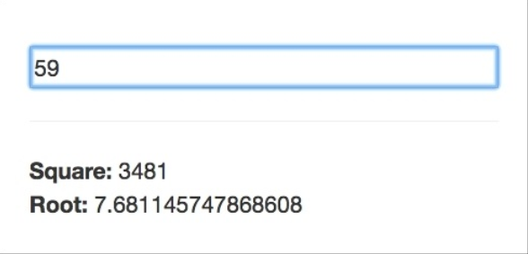

数据被立刻响应在自定义插件中的指令上

### 练习
用三角函数(sine, cosine, tangent)来增强 MathPlugin 。
当然你也可以使用 *Annexes*。

## 方程式状态和 Vuex
当方程式达到一定体积时， 有必要来管理全局的的状态了。 受到 Flux( https://facebook.github.io/flux/) 的启发，我们有了 Vuex 来管理共享 Vue 组件中的状态。

### Tip
别以为这很难理解哦(●'◡'●)。 实际上呢，就是些数据。 每个组件拥有它自己的数据， "方程式状态" 指的就是可以在组件中共享的数据！

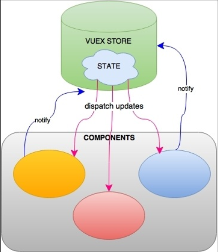

Vuex 是如何管理状态更新的

就像其它插件， 你需要通知 Vue 来 use 它。

```js
import Vuex from 'vuex';
import Vue from 'vue';

Vue.use(Vuex);

var store = new Vuex.Store({
  state: { <...>},
  mutations: {<...>}
});
```

然后初始化组件， 声明实例化 store

```js
new Vue({
  components: components,
  store: store
});
```

现在呢， 主程序和它所有的组件已经知道了 store , 并可以访问它了， 也可以在方程式的生命周期里制动。 我们将在后面的章节仔细研究它。

## vue-cli

是的， 没错 Vue 拥有自己的命令行工具。 它可以帮助我们初始化任何我们想配置的 Vue 方程式。 你可以使用 Webpack 模板， Browserify 模板， 或者只创建一个简单的 **HTML** 文件。

*npm* 安装：

**npm install -g vue-cli**

各种初始化方程式的方法：

```
vue init webpack
vue init webpack-simple
vue init browserify
vue init browserify-simple
vue init simple
```

为了查看区别， 我们通过运行 *vue init* 来创建一个简单的模板和 Webpack 模板， 看看生成的结构有什么区别。

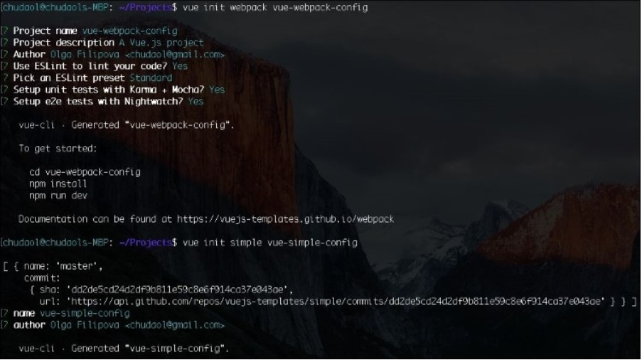

vue init simple 和 vue init webpack 的输出

下面是方程式结构的区别：

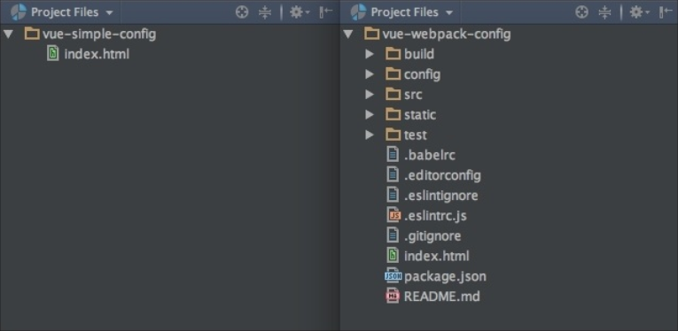

vue init simple 和 vue init webpack 生成的文件结构差别

*index.html* 文件只是一个包含 Vue.js 的简单配置文件， 所以如果你只是想搞个快速原型的话， 就用这个吧。

如果你想搞个可以测试及热加载的复杂单页应用的话， 使用 Webpack 或者 Browserify 配置。

## IDEs 的 Vue 插件
这里有许多 Vue 语法高亮插件：


## 安装， 使用， 调试 Vue.js 方程式

在这部分我们要分析所有安装 Vue.js 的方法， 我们会创建一个在后续章节中继续开发的应用的骨架。 我们也会学习调试测试方程式的几种方法。

### 安装 Vue.js
这里有一堆方法去安装 Vue.js ，下载脚本后引入 HTML 文件中的 script 标签中， 使用 bower , npm 或者 Vue 的 命令行工具都可以启动整个方程式。

我们选一种自己最喜欢的就行， 我们开始吧。

### 独立安装

下载 *vue.js*。 这里有多个版本， 简化版和开发版。 开发版在这 ( https://vuejs.org/js/vue.js) 。 精简版在这 (https://vuejs.org/js/vue.min.js ) 。

### Tip
如果你是在开发环境中， 请用非压缩的版本。 你会爱上这些在控制台打出的小提示和警告的。

在 script 标签内引入 vue.js ：

```html
<script src="vue.js"></script>
```

Vue 已经被注册为全局变量了， 你可以直接使用它：

```html
<div id="app">
 <h1> {{ message }} </h1>
</div>
<script src="vue.js"></script>
<script>
  var data = {
    message: 'Learning Vue.js'
  };
  new Vue({
    el: '#app',
    data: data
  });
</script>
```

### CDN
Vue.js 可从下面 CDN 获取
* jsdeliver: https://cdn.jsdelivr.net/vue/2.0.3/vue.js
* cdnjs:  https://cdnjs.cloudflare.com/ajax/libs/vue/2.0.3/vue.js
* unpkg:  https://unpkg.com/vue@2.0.3/dist/vue.js (推荐)

在你的 *script*  中加入路径即可使用

```html
<script src=" https//cndjs.cloudflare.com/ajax/libs/vue/2.0.3/vue.js">
</script>
```

### Tip

CDN 版本有可能不与最新版同步。

我们的例子有可能与独立安装的版本不一致， 我们使用了 CDN。

### Bower

如果你已经使用了 Bower 来管理方程式， 也不想用别的工具， 这里也可以使用 Bower 下载。

```
# 最新版
bower install vue
```

我们的事例就像前两个一样， 只不过已经换成在 bower 文件中啦(●'◡'●)。

```html
<script src="bower_components/vue/dist/vue.js"></script>
```

### CSP-compliant

内容安全协议是一项标准协议， 所有的方程式应该遵守从而避免安全攻击。 如果你是为浏览器开发方程式， 你一定对这条协议很熟悉。

对那些要求兼容 CSP 的脚本环境， 这里有个特殊版本的 Vue.js https://github.com/vuejs/vue/tree/csp/dist 。

我们来示范一下在 Chrome 方程式中的关于 Vue.js 的 CSP-compliant！

首先为我们的事例创建一个文件夹。 在 Chrome 方程式中最重要的是 *manifest.json* 文件， 它用于描述你的方程式。 创建并写入下面信息：

```json
{
  "manifest_version": 2,
  "name": "Learning Vue.js",
  "version": "1.0",
  "minimum_chrome_version": "23",
  "icons": {
    "16": "icon_16.png",
    "128": "icon_128.png"
  },
  "app": {
    "background": {"scripts": ["main.js"]
    }
  }
}
```

下一步来创建我们的 *main.js* 文件， 它作为 Chrome 方程式的入口。 脚本应该监听方程式的启动并打开指定大小的新窗口。 我们指定窗口大小为 500 x 300 , 在 *index.html* 打开。

```js
chrome.app.runtime.onLaunched.addListener(function () {
  // 窗口居中
  var screenWidth = screen.availWidth;
  var screenHeight = screen.availHeight;
  var width = 500;
  vai height = 300;

  chrome.app.window.create("index.html", {
    id: "learningVueID",
    outerBounds: {
      widthL width,
      height: height,
      left: Math.round((screenWidth - width) / 2),
      top: Math.round((screenHeight - height) / 2)
    }
  });
});
```

现在，Chrome-specific 方程式的神奇魔法已经结束， 我们需要创建我们的 *index.html* 文件， 就像前面一样写入相同的代码。

```html
<html lang="en">
  <head>
  <meta charset="UTF-8">
  <title>Vue.js - CSP-compliant</title>
  </head>
  <body>
    <div id="app">
    <h1>{{ message }}</h1>
    </div>
    <script src="assets/vue.js"></script>
    <script src="assets/app.js"></script>
  </body>
</html>
```
下载好 CSP-compliant 版本的 Vue.js 并把它添加到 assets 文件夹。

好了， 我们一起来创建 *app.js* 文件吧。

```js
var data = {
  message: "Learning Vue.js"
};
new Vue({
  el: "#app",
  data:  data
});
```

把它放到 assets 文件夹中。

别忘了创建两个 16 像素和 128 像素的 icon 哦。

你的代码应该和我的会很像：

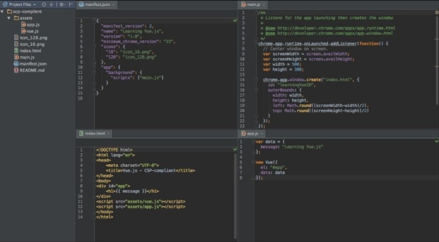

使用 vue.js 为 Chrome 方程式提供的代码结构

当然最重要的事是来测试一下哦！

1. 在你的 Chrome浏览器中打开 chrome://extensions/url
2. 切换到开发者模式
3. 点击安装扩展， 找到我们刚创建的文件夹
4. 你的方程式就会出现在列表中了！ 点击启动。

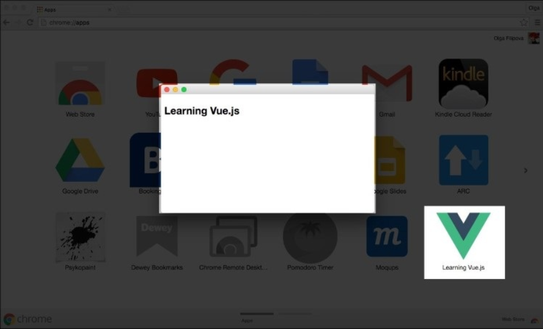

用 vue.js 制作的简单 Chrome 方程式

恭喜！ 你已经制作了一个 Chrome 方程式。

### npm
npm 安装方式用于大规模应用。 启动 *npm install* 就像下面这样：

```
#最新稳定版
npm install vue
# 最新稳定 的CSP-compliant 版本
npm install vue@csp
```

然后引用它：

```js
var Vue = require("vue");
```

如果你喜欢 ES2015 ，可以这样引入

```js
import Vue from "vue"
```

我们的 **HTML** 文件看起来是这样的：

```html
<html lang="en">
  <head>
  <meta charset="UTF-8">
  <title>Vue.js - NPM Installation</title>
  </head>
  <body>
    <div id="app">
    <h1>{{ message }}</h1>
    </div>
    <script src="main.js"></script>
  </body>
</html>
```

现在创建 *script.js* 它应该就像独立版或 CDN 安装的那样， 只是在 require 这里不一样。

```js
var Vue = require('vue/dist/vue.js');
var data = {
  message: 'Learning Vue.js'
};

new Vue({
  el: "#app",
  data: data
});
```

我们需要安装 Vue 和 Browserify 来把我们的 *script.js* 编译到 *main.js* 中：

```
npm install vue --save-dev
npm install browserify --save-dev
```

在 *package.json* 文件中， 加点脚本来启动 Browserify 。我们的 *package.json* 就像下面这样：

```json
{
  "name": "learningVue",
  "scripts": {
    "build": "browserify script.js -o main.js"
  },
  "version": "0.0.1",
  "devDependencies": {
    "browserify": "^13.0.1",
    "vue": "^2.0.3"
  }
}
```

现在运行一下命令：

**npm run build**


打开 *index.html*

我有个朋友在这时说： 啥？ 这么多步骤， 安装， 命令行， 说明....结果就是这样的？ 手动再见。

如果你也这么想， 当然你以一种复杂的方法在做一件简单的事， 但是当你的方程式有更大规模的时候， 你会发现用上这些工具会把那些复杂的事会变得更加简单， 哈哈哈， 该休息下了！

### vue-cli
正如我们前面提及的， Vue 提供了自己的命令行工具， 它允许我们以我们想要的工作流来启动单页方程式。 它也提供了热重载及测试开发环境。 安装完 *vue-cli* 后， 运行 *init <模板> <项目名>* 就行了。

```
# 安装 vue-cli
$ npm install -g vue-cli
# 创建项目
$ vue init webpack learn-vue
# 安装运行
$ cd learn-vue
$ npm install
$ npm run dev
```

现在打开 *loaclhost:8080* 。 打开源文件， 你可以看到 *app.vue* 文件， 你还记得我们说组件就像构建我们方程式的砖块一样吗？ 记得我们在 *main.js* 中创建注册组件， 我提示你说我们将学习更加优雅地构建组件吗？  哈哈， 你现在就会知道如何以一种更棒的方法来构建组件了！

找到 *import Hello from './components/Hello'* 这行。 这正好说明了组件如何在另外的组件中被使用。看看上面的模板文件， 它包含 <hello></hello> 标签。 在 **HTML** 文件中 *hello* 组件就是这样呈现的。 看看这个组件； 它在 *src/components* 文件夹中。 如你所见， 这确实和我们之前做的很像。 我们来修改一下：

```html
<script>
  export default {
  data () {
    return {
    msg: "Learning Vue.js"
    }
  }
}
</script>
```

在 *App.vue* 组件里移除除了 *hello* 标签外的模板：

```html
<template>
  <div id="app">
    <hello></hello>
  </div>
</template>
```

现在返回方程式， 你将看到以下图片：

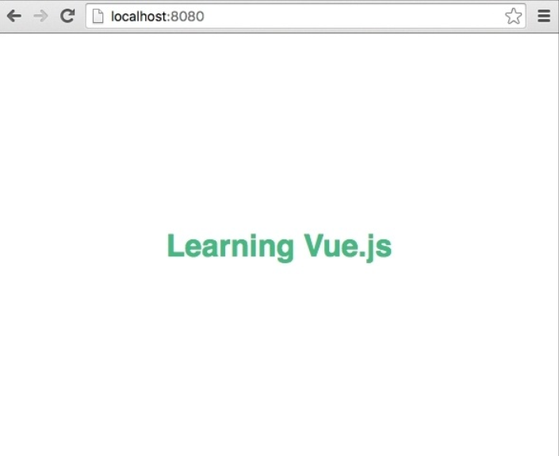

用 vue-cli 启动 Vue 方程式

### Tip
除了 Webpack 模板外，你还可以选择下面几种配置

* webpack-simple： 精简版， Webpack + vue-loader ，适合快速原型
* browserify： 完整版， Browserify + Vueify + hot-reload, linting, init-testing
* browserify-simple： 精简版， Browserify + Vueify , 适合快速原型
* simple： 最简单的版本

### 开发构建

我亲爱的读者， 你已经知道了如何安装使用 Vue.js ，也明白了它的运行机制， 你一定跃跃欲试了吧！

俺明白。 你需要从 GitHub 下载开发版的 Vue.js。

我们这就来构建一个事例。 创建像 *dev-build* 之类的文件夹， 把所有 npm 文件拷贝进去。

```
cd <APP-PATH>/node_modules
rm -rf vue
git clone https://github.com/vuejs/vue.git
cd vue
npm install
npm run build
```

现在构建我们的方程式

```
cd <APP-PATH>
npm run build
```

打开 *index.html*  ； 我们看到了 *Learing Vue.js* 的标题。

我们再来修改一点 vue.js 的源码！ 找到 *node_modules/vue/src/compiler/parser* 文件夹， 打开 *text-parser.js* 文件， 找到下面这行：

```js
const defaultTagRE = /\{\{((?:.|\n)+?)\}\}/g
```

实际上这个正则定义了 **HTML** 模板中默认的分隔符。 分隔符里面的东东被认为是 Vue 数据 或 JavaScript 代码。 我们来修改一下！ 我们用 *% %* 来替代 *{}* ：

```js
const defaultTagRE = /\%\%((?:.|\n)+?)\%\%/g
```

现在重新构建 Vue 源码， 刷新浏览器， 瞧瞧我们发现了什么？

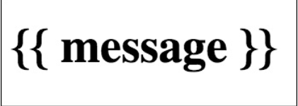

在改变 Vue 源码后， *{{}}* 不能正常执行了！

那些在 *{{}}* 内的信息已经不能被 Vue 识别了， 事实上， 它被当成了 **HTML** 的一部分。

现在我们打开 *index.html* ， 用 *%%* 替代 *{{}}* ：

```html
<div id="app">
  <h1>%% message %%</h1>
</div>
```

重新构建，刷新浏览器， 现在怎么样了？ 又好了！ 哈哈， 我敢肯定你现在有一大堆想法来定制 Vue.js ，还等什么， 马上出发吧！

## 调试你的 Vue 方程式

你可以像调试其它网络方程式一样调试 Vue。 使用你自己的开发者工具 (firebug), breakpoints, debugger statements.... 如果你想仔细研究 Chrome 的调试工具可以看看这个文档 https://developer.chrome.com/devtools。

我们也提供 Vue.js 的开发者工具， 它很容易调试 Vue 方程式。 你可以从 Chrome 商店里下载安装 https://chrome.google.com/webstore/detail/vuejsdevtools/nhdogjmejiglipccpnnnanhbledajbpd 。

扫兴的是， 它不能调试本地打开的文件， 搭建一些简单的服务器就行拉(例如 https://www.npmjs.com/package/http-server )。

然后安装， 打开，我们的购物清单方程式， 打开开发者工具， 你可以看到 Vue 选项卡已经出现啦：

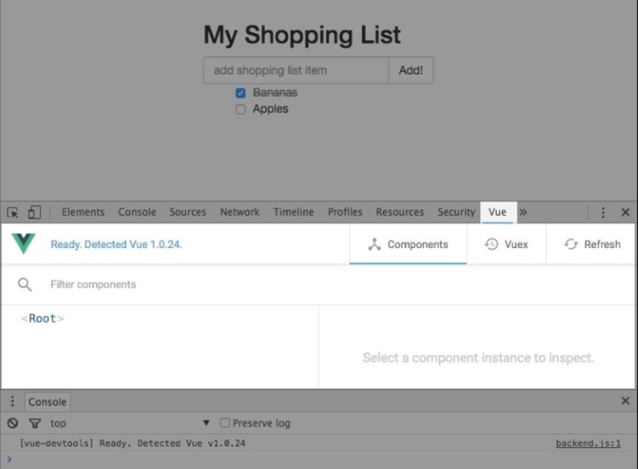

Vue 开发者工具

在这里， 我们只有一个组件 -- Root 。 你可以想象， 当我们有一堆组件时， 它们将会出现在 Vue 开发工具的调试盘上。 点击 Root 组件并检查。 你可以看到所有绑定到这个组件上的数据。 如果你想改变一些， 例如， 增加一个列表项， 切换复选框， 改变标题....所有的改变都将被传播到 Vue 开发者工具上。 你可以在右手边看到变化。 我们这就来试试， 增加一条列表项。

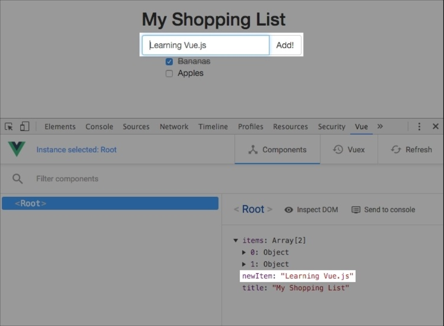

模型内的变化将迅速同步到 Vue 开发者工具中。

## 搭建我们方程式

你还记得在第一章我们开始的方程式吗？ 购物清单和番茄钟。 在这个部分， 我们将使用 *vue-cli* 来搭建我们方程式， 让它包含可重用的组件， 可测试， 易于部署。
一旦我们启动了方程式， 我们便会一直使用它到本书最后。 好吧， 我们开始吧！

### 生成购物清单脚手架
我们将使用 *vue-cli* 生成 Webpack 配置的购物清单脚手架。

### Tip

记得先安装 *vue-cli* ： **npm install -g vue-cli**

如果你已经安装了 *vue-cli*, 打开你要创建方程式的文件夹， 输入：

```
vue init webpack shopping-list
```

所有的问题都回答 yes ! 然后你的方程式就启动了：


用 vue-cli 启动购物清单方程式

切换到购物清单文件夹， 运行 *npm install, npm run dev*。 在你的浏览器中打开 *loaclhost：8080* , 你将看到 **Hello World** 页面。


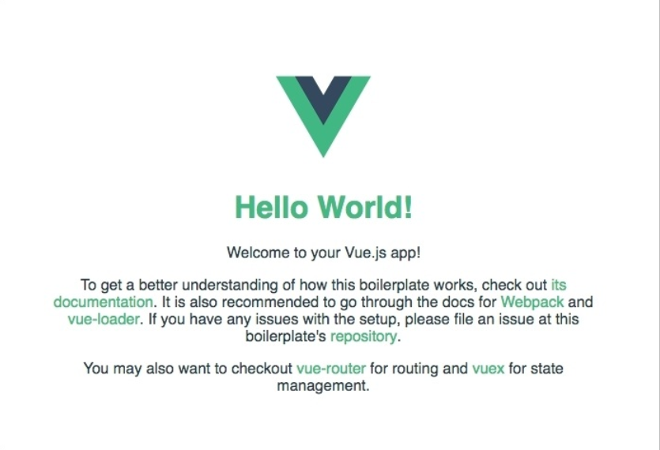

新创建的 Hello World 视图

我们来清空启动代码， 从而添加上我们自己的代码。 进入 *App.vue* 文件，删除所有东东， 只留下下面的结构：

* template
* script
* style

在最后我们的 *App.vue* 文件应该像这样：

```html
<template>
  <div id="app">
  </div>
</template>

<script>
</script>

<style>
</style>
```

打开文件看看效果， 嗯，很好。 其实你啥事都没做， 一个空白页。

我们往 template 标签内加点东西， 查看页面， 它自动更新啦。 这是因为 *vue-hot-reload* 插件发现了你在 Vue 组件中改动， 它自动重构建了项目， 而且重新刷新了浏览器页面。 试试在 script 标签内写点东西， 比如一个未定义的变量：

```html
<script>
  notDefinedVariable = 5;
</script>
```
页面不会刷新， 在你的命令行里看看， 它显示了一个错误：


每次文件变化， lint 也会被启动。

这是由于 ESLint 插件的原因， 所以会在代码变化时执行 lint 。

有了它， 我们可以保证代码的质量。

说到质量， 我们应该准备让我们的方程式运行单元测试。

幸好， Webpack 版的 *vue-cli* 已经为我们安排好了。 运行 *npm run unit* 就可以运行单元测试了， 运行 *npm e2e* 运行端对端测试。  因为端对端测试和方程式用了相同的端口， 它俩不能同时启动。 所以， 如果你想在开发时跑测试， 你应该在 *config/index.js* 里改变端口， 或者暂停方程式。 在测试后， 我们发现测试失败了。 这是因为它检查了那些我们移除的具体元素。 打开 *test/e2e/specs* 文件夹， 清除所有我们不需要的断言。 看起来应该是这样的：

```js
module.exports = {'default e2e tests': function (browser) {
  browser
  .url('http://localhost:8080')
    .waitForElementVisible('#app', 5000)
    .end()
  }
}
```

返回测试。 现在能通过了。 从现在开始， 我们需要在我们的方程式里增加一些代码， 然后再写些单元测试和端对端测试。

### 启动你的番茄钟

运行 *vue init webpack pomodoro* 重复必要的步骤， 开始运行。

## 练习
将番茄钟打造成一个 Chrome 方程式！ 你只需要使用 CSP-compliant 版本的 Vue.js 并添加 *manifest.json* 文件。

## 总结
在本章，我们分析了 Vue.js 幕后的东东。 你已经知道了响应式数据是如何实现的。 你看到了 Vue.js 使用 *Object.defineProperty* 的 *getters 和 setters* 来传播数据变化。 你看到了 Vue.js 的关键概念，像是可重用的组件， 插件系统， 状态管理。 我们已经启动了在后续章节持续开发的方程式。

在下一章， 我们将深入 Vue 的组件系统。 我们将在方程式中使用组件。
