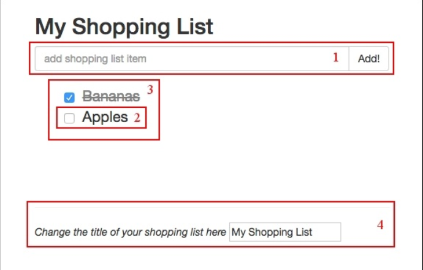
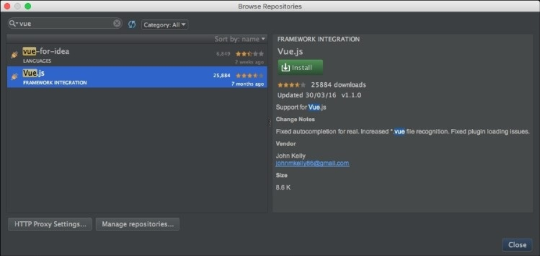
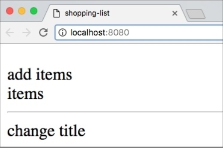
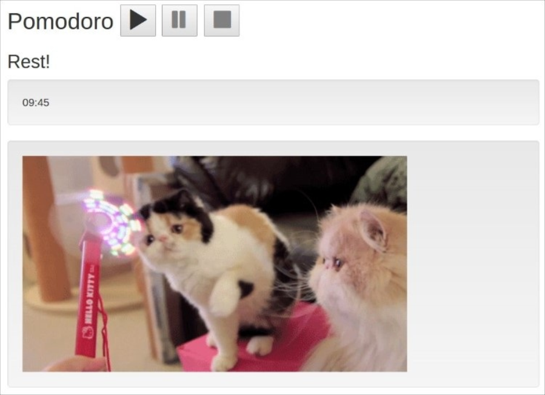
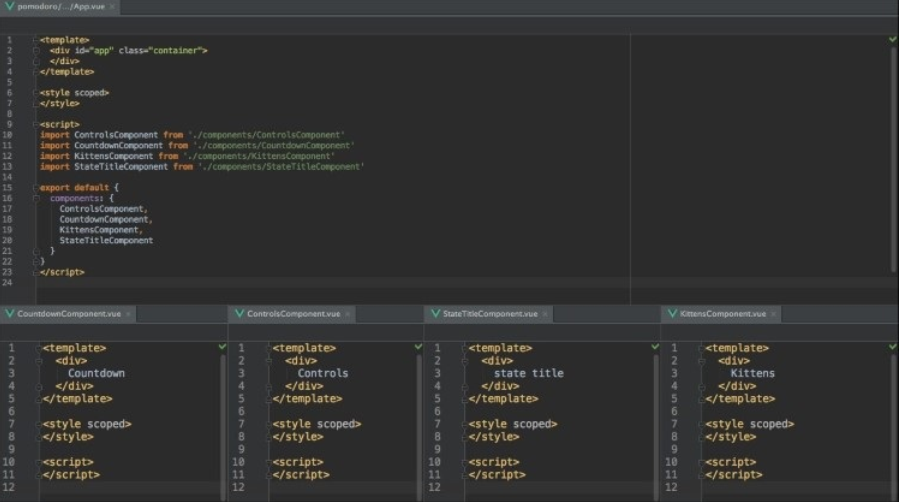

# Components – Understanding and Using

在前面一章， 你已经知道了 Vue.js 是如何运作的。 你探究了 Vue 的幕后并改动了一点 Vue.js 源码。 你学习了一些 Vue 的关键概念， 也尝试了几种安装 Vue 的方法。 我们已经启动了项目； 我们将继续开发完善。 我们也知道了如何调试测试我们的方程式。

在第一章， 我们讨论了组件甚至创建了一些。 在这章， 我们将继续使用组件并时间一些有趣的指令。 换句话说， 我们要：

* 重返组件话题回顾组件到底是什么
* 为我们的方程式创建组件
* 学习什么是单文件组件
* 学习如何用特性去达到响应式的 CSS 变换

## 回顾组件

正如你在前面章节所记得， 组件是 Vue 方程式中拥有自己作用域， 数据， 方法的特殊部分。 方程式可以使用组件并重用它。 前一章， 你知道了组件以 *Vue.extend({...})* 方法创建， 以 *Vue.component()* 语法注册。 所以为了创建使用组件我们需要这样做：

```
//创建组件
var HelloComponent = Vue.extend({
  template: '<h1>Hello</h1>'
});
//注册组件
Vue.component('hello-component', HelloComponent);
//初始化 Vue 方程式
new Vue({
  el: '#app'
});
```

我们在 **HTML** 中这样使用组件：

```
<div id='app'>
  <hello-component></hello-component>
</div>
```

### Tip
初始化及注册可以写成单个 Vue 组件的规范写法：

```
Vue.component('hello-component', {template: '<h1> Hello </h1>'});
```

### 使用组件的好处
在深入探究组件重写方程式前我们了解一些东东。 在本章， 我们将覆盖以下内容： 在组件中控制 *data* 及 *el* 属性， 组件模板， 作用域和预处理器。

### 在 HTML 中声明模板

在我们这个例子中， 我们创建了一个用字符串重写的 Vue 组件。 它非常简单， 因为我们需要的都在其中。 现在， 想象一下我们的组件有一个更为复杂的 HTML 结构。 用字符串模板编写复杂组件容易出错， 冗余而且违反最佳实践。

### Tip

我指的最佳实践是说简洁可维护的代码。 用字符串写的复杂的 **HTML** 完全不具可维护性。

Vue 可以通过 template 标签在 **HTML** 声明模板。

在 **HTML** 中重写我们的事例。

```
<template id="hello">
  <h1>Hello</h1>
</template>
```

然后再里面加上我们的组件， 我们需要一个 ID 来指定模板。

```
Vue.component('hello-component', {
  template: '#hello'
})
```
我们的整个代码看上去像这样：

```
<body>
  <template id="hello">
    <h1>Hello</h1>
  </template>
  <div id="app">
    <hello-component></hello-component>
  </div>
  <script src="vue.js"></script>
  <script>
    Vue.component('hello-component', {
      template: '#hello'
    });
    new Vue({
      el: '#app'
    });
  </script>
</body>
```

在前面的事例里， 我们只在组件中使用了 *template* 特性。 现在让我们来看看 *data* 和 *el* 特性应该在组件里如何配置。

## 在组件里控制 data 和 el 属性
正如前面提及的， 组件的语法和 Vue 实例的语法很想， 但是它必须扩展自 Vue 而非直接被调用。 有了这个前提， 貌似这样创建组件才对：

```
var HelloComponent = Vue.extend({
  el: '#hello',
  data: {msg: 'hello'}
})
```

但是这样会导致作用域泄漏， 每一个 *HelloComponent* 实例都会共享相同的 *data 和 el*。 这不是我们想要的。  这就是 Vue 为什么会明确地要求我们以函数的形式来声明这些属性。

```
var HelloComponent = Vue.component('hello-component', {
  el: function () {
  return '#hello';
  },
  data: function () {
    return {
      msg: 'Hello'
    }
  }
});
```

甚至当你以对象的方式声明 *data* 和 *el* 时， Vue 会有善意的警告。


Vue 会在你用对象作为数据时发出警告

## 组件的作用域

正如已经提到的， 所有的组件拥有它们自己的作用域， 而且不会被其他组件访问到。 然而， 全局的方程式作用域可以被所有注册过的组件访问到哦。
你可以看到组件的作用域是本地的， 而方程式的作用域是全局的。 这是当然的。 但是， 在组件内不能使用父作用域。你不得不明确指出到底哪个组件的父级数据属性可以被访问，通过使用 *prop* 属性，然后再用 *v-bind* 语法把他们绑定到组件实例上。

我们可以先声明 HelloComponent 组件并包含数据及 msg 特性：

```
Vue.component('hello-component', {
    data: function () {
      return {
        msg: 'Hello'
      }
    }
});
```

创建 Vue 实例并包含一些数据：

```
new Vue({
  el: '#app',
  data: {
    user: 'hero'
  }
});
```

在我们的 **HTML** 里， 创建模板并以 ID 的形式应用到组件上：

```
//模板声明
<template id="hello">
  <h1>{{msg}} {{user}}</h1>
</template>

//在组件中使用模板
Vue.component('hello-component', {
  template: '#hello',
  data: function () {
    return {
    msg: 'Hello'
    }
  }
});
```
为了在页面中看到组件， 我们应该在 **HTML** 中调用它：

```
<div id="app">
 <hello-component></hello-component>
</div>
```

如果你在浏览器中打开页面， 你只能看到 **Hello** ； *user* 数据属性未被绑定到组件中：


父级的数据属性未被绑定到 Vue 组件中。

为了绑定父级的数据， 我们不得不做以下两件事：

* 在 props 特性中指明这个属性
* 把它绑定到 hello-component 调用

```
//在组件里调用父级数据特性
Vue.component('hello-component', {
  template: '#hello',
  data: function () {
    return {
      msg: 'Hello'
    }
},
  props: ['user']
});

//向组件绑定 user 数据属性
<div id="app">
<hello-component v-bind:user="user"></hello-component>
</div>
```

刷新页面， 你将看到如下消息：


纠正向父级数据属性的绑定后， 一切按期执行了。

### Tip
实际上， *v-bind:user* 语法可以有如下的简写：

```
<hello-component :user="user"></hello-component>
```

## 组件嵌套组件

组件的完美之处在于它们可以在其它组件里面重用这就像乐高中的砖块一样！ 我们来创建另一个组件； 一个叫 **greetings** 被两个二级组件(form asking 和 hello component )组成的组件。

我们先来声明模板：

```
<!--form 模板-->
<template id="form">
  <div>
    <label for="name">What's your name?</label>
    <input v-model="user" type="text" id="name">
    </div>
</template>
  //saying hello 模板
<template id="hello">
  <h1>{{msg}} {{user}}</h1>
</template>
```

现在，我们在这些模板的基础上来注册两个 Vue 组件：

```
//注册 form 组件
Vue.component('form-component', {
  template: '#form',
  props: ['user']
});
//注册 hello 组件
Vue.component('hello-component', {
  template: '#hello',
  data: function () {
  return {
    msg: 'Hello'
  }
},
  props: ['user']
});
```

最后， 我们将创建我们的 greetings 模板， 它使用了 *form 和 hello* 组件。 别忘了我们已经向组件绑定了 *user* 属性。

```
<template id="greetings">
  <div>
  <form-component :user="user"></form-component>
  <hello-component :user="user"></hello-component>
  </div>
</template>
```

此时， 我们可以创建我们的 greetings 组件并在内使用 greetings 模板。

我们在这个组件内初始化带 user 名字的数据函数：

```
//基于 greetings 模板创建 greetings 组件
Vue.component('greetings-component', {
  template: '#greetings',
  data: function () {
    return {
      user: 'hero'
    }
  }
});
```

在我们的主要方程式中， 调用 greetings 组件：

```
<div id="app">
  <greetings-component></greetings-component>
</div>
```

别忘了初始化 Vue 实例

```
new Vue({
  el: '#app'
})
```

在浏览器中打开页面， 你可以看到如下输出：


一个由不同组件构成的页面

尝试在 input 内改变 name 值。你会期望它改变因为我们已经绑定了它， 但是奇怪的是， 改变并未发生。 啊哦， 就是这样。 默认情况下， 所有的属性遵守单向数据绑定。 这意味着在父级作用域内的变化将通知到所有子极组件反之却会失效。 这可以防止子极组件意外破坏父级状态。 就是这样， 但是， 也可以通过调用 *events* 强迫子极组件与他们的父级通信。 具体查看 Vue 文档 https://vuejs.org/guide/components.html#Custom-Events。

在我们的例子中， 我们可以在每次输入变化时向 form input 组件绑定 user 模型， 然后分发 input 事件。 我们通过使用 *v-on:input* 修饰符来完成它， 就如在这里被描述的一样  https://vuejs.org/guide/components.html#Form-Input-Components-using-Custom-Events 。

因此， 我们必须向 form-component 传入 *v-model="user"* ：

```
<form-component v-model="user"></form-component>
```

然后， form-component 应该接收 value 属性并分发 input 事件：

```
Vue.component('form-component', {
  template: '#form',
  props: ['value'],
  methods: {
    onInput: function (event) {
      this.$emit('input', event.target.value)
    }
  }
});
```

在 form-component 模板内的输入框应该绑定 *v-on:input* 和用 *v-on:input* 修饰符的 onInput 方法：

```
<input v-bind:value="value" type="text" id="name" v-on:input="onInput">
```

### Tip

事实上， 在先前的 Vue 2.0 中，这种在组件和父级间双向的同步是可以通过 **sync** 修饰符来交流属性的：

```
<form-component :user.sync="user"></form-component>
```

刷新页面。 你现在就可以改变输入框内的值了， 它会迅速地传递给父级作用域， 从而也可通知给其它子组件。


通过 .sync 修饰符可以在父级和子组件间形成双向绑定。

你可以在这里发现这个事例 https://jsfiddle.net/chudaol/1mzzo8yn/。

### Tip

在 Vue 2.0 版本前， 这里还有其它数据绑定修饰符， *.once* 。用这个修饰符， 数据将只绑定一次， 任何其它的变化不再影响到组件的状态。 比较下面几种方式：

```
<form-component :user="user"></form-component>

<form-component :user.sync="user"></form-component>

<form-component :user.once="user"></form-component>
```

## 用一个简单组件来重写购物清单

既然我们已经深入了解了组件， 我们就来用组件重写购物清单吧。

### Tip
对于需要重写的方程式， 我们需要基于这个版本  https://jsfiddle.net/chudaol/vxfkxjzk/3/。

当我们开始讨论组件的时候， 我们就已经这样做过了。 不过在那时我们使用了模板字符串来设置组件。 现在我们用刚刚学习的组件配置来重写。 我们再来看看组件的界面和标识。



我们的购物清单有四个组件

因此， 我建议应该包含这个四个组件：
* AddItemComponent： 增加新的列表项
* ItemComponent： 渲染后的购物列表
* ItemsComponent： 渲染并操作列表
* ChangeTitleComponent： 改变标题

## 为组件们定义模板
为我们的组件提供模板， 假设组件已经被定义注册。

### 注意

**CamelCase VS kebab-case** 你可能已经注意到我们在声明组件名字时使用了驼峰式 *( var HelloComponent = Vue.extend({...}))* ，我们以短横线隔开式来命名它们： *Vue.component('hello-component',　{...})* 。 我们这么做是因为 **HTML** 不区别大小写的特性。 因此呢， 我们的组件将会是这个样子地：

```
add-item-component

item-component

items-component

change-title-component
```

可以在这里看一下我们以前的例子  ( https://jsfiddle.net/chudaol/vxfkxjzk/3/ )。

我们来用模板和组件名重写它。 在这部分， 我们将只关心呈现层， 对于数据绑定的控制留到后面。 我们只复制粘贴方程式的部分 **HTML** 然后在我们的组件中重用。 我们的模板看起来像下面的这样：

```
<!--add new item template-->
<template id="add-item-template">
  <div class="input-group">
  <input @keyup.enter="addItem" v-model="newItem"
  placeholder="add shopping list item" type="text"
  class="form-control">
  <span class="input-group-btn">
  <button @click="addItem" class="btn btn-default"
  type="button">Add!</button>
  </span>
  </div>
</template>

<!--list item template-->
<template id="item-template">
  <li :class="{ 'removed': item.checked }">
  <div class="checkbox">
  <label>
  <input type="checkbox" v-model="item.checked"> {{ item.text }}
  </label>
  </div></li>
</template>

<!--items list template-->
<template id="items-template">
  <ul>
  <item-component v-for="item in items" :item="item">
  </item-component>
  </ul>
</template>

<!--change title template-->
<template id="change-title-template">
  <div>
  <em>Change the title of your shopping list here</em>
  <input v-bind:value="value" v-on:input="onInput"/>
  </div>
</template>
```

我们的中枢组件将包含一些组件。

```
<div id="app" class="container">
  <h2>{{ title }}</h2>
  <add-item-component></add-item-component>
  <items-component :items="items"></items-component>
  <div class="footer">
    <hr/>
    <change-title-component v-model="title"</change-title-component>
  </div>
</div>
```

如你所见， 模板的主要部分都是复制粘贴了相应的 **HTML** 代码。

但是呢， 这里有很多重要的不同点。 在 list item 模板中， 作了轻微的改动。 你已经在前面学习了 *v-for* 指令。 在前面的例子中， 我们把它用在 <li> 这样的元素上。 现在你将看到我们同样把它应用在 Vue 自定义组件上。

你同样可能观察到了在标题模板上的小变化。 现在它有了一个绑定到它身上的值， 也使用了 *v-on:input* 修饰符进行分发 *onInput* 方法。 正如你在前面所学习的， 子组件不能在没有事件系统的情况下直接影响父级数据。

## 定义注册所有组件

先看一眼我们先前做的购物清单方程式： https://jsfiddle.net/chudaol/c8LjyenL/ 。 我们来加点创建组件的代码。 我们将使用模板的 ID 来定义组件的模板特性。 同时， 别忘了从父级传入的 *props* 特性。 因此， 我们的代码如下：

```
//add item component
Vue.component('add-item-component', {
  template: '#add-item-template',
  data: function () {
    return {
      newItem: ''
    }
}
});

//item component
Vue.component('item-component', {
  template: '#item-template',
  props: ['item']
});

//items component
Vue.component('items-component', {
  template: '#items-template',
  props: ['items']
});
//change title component
Vue.component('change-title-component', {
  template: '#change-title-template',
  props: ['value'],
  methods: {
    onInput: function (event) {
      this.$emit('input', event.target.value)
    }
  }
});
```

如你所见， 在每个组件的 *props* 特性中， 我们都传入了不同的数据特性。 我们同样在 *add-item-template* 组件里移入了 *newItem* 特性。 在 *change-title-template* 组件里增加了 *onInput* 方法用来分发输入事件， 所以用户的操作才会影响到父级组件。

在浏览器里打开 **HTML** 文件。 界面和以前的一模一样！ 我们完成的代码可以在这里查看 https://jsfiddle.net/chudaol/xkhum2ck/1/。

## 练习

尽管我们的方程式看起来没什么变化， 它的功能却不在了。 不仅无法增加列表项， 而且会在控制台输出错误信息。

请使用事件系统为我们的组件添加功能。

在附录里的练习答案参考里有一个解决方案。

## 单文件组件

我们知道以前的最佳实践是分离 **HTML 、 CSS、 JavaScript**。 一些例如 React 的现代化的框架慢慢越过了这个规则。 当今在一个单文件里写结构， 样式， 逻辑代码已经很普遍了。 事实上， 对于一些小型组件， 我们完全可以转换成这种架构。 Vue 同样允许你在同一个文件里定义一切东东。 这种类型的组件被认为是单文件组件。

### 注意

单文件组件以 *.vue* 结束。 想这种类型的方程式可以使用 *webpack vue* 来配置。 生成这种类型的方程式， 最简单的方法就是使用 *vue-cli* (https://github.com/vuejs-templates/webpack)。

一个 Vue 组件可以由三部分组成：

* script
* template
* style

每个部分就如你所想的那样。 在 template 标签内放入 **HTML** 模板， 在 script 标签内放入 JavaScript 代码， 在 style 标签内放入 CSS 样式。

你还记得我们的 *hello-component* 组件吗？ 从这里回顾一下 https://jsfiddle.net/chudaol/mf82ts9a/2/ 。

通过使用 *vue-cli 的 webpack-simple* 命令来生成脚手架。

```
npm install -g vue-cli vue init webpack-simple
```

以 Vue 组件来重写它， 创建我们的 *HelloComponent.vue* 文件， 增加如下代码：

```
<template>
  <h1>{{ msg }}</h1>
</template>

<script>
export default {
  data () {
    return {
      msg : 'Hello!'
    }
  }
}
</script>
```

注意我们不需要为我们的组件增加特殊的模板标记。
作为一个单文件组件， 它已经隐式地说明了模板已经只作用这个文件了。 你可能注意到这里有些 ES6 的语法。 当然， 也别忘了数据特性应该是个函数而非对象。

在我们的中枢脚本中， 我们需要创建 Vue app 来通知脚本使用 *HelloComponent* 组件：

```
import Vue from 'vue'
import HelloComponent from './HelloComponent.vue'
new Vue({
  el: '#app',
  components: { HelloComponent }
});
```

我们在 *index.html* 中的标记将不会改变。 它依然需要调用 *hello-component* ：

```
<body>
  <div id="app">
    <hello-component></hello-component>
  </div>
  <script src="./dist/build.js"></script>
</body>
```

我们现在只需要安装 *npm* 依赖了(如果还没有的话)， 构建方程式。

```
npm install
npm run dev
```

搞定， 你的浏览器将自动打开 *localhost:8080* 页面。

你可以在[chapter3/hello/](https://github.com/PacktPublishing/Learning-Vuejs-2/tree/master/chapter3/hello) 查看代码。

你也可以在 webpackbin 中修改， 测试。 查看 *hello* 组件 http://www.webpackbin.com/N1LbBIsLb。

### Tip
Webpackbin 是一项可以运行测试以 Webpack 构建的方程式的很棒的服务。 尽管还是测试版依然是一款好工具。 当然也有一些小问题， 例如， 当你下载整个项目时， 它将不会运行。

## IDEs 插件
Vue 的创造者和贡献者也想着咱们开发者呢， 这里有一堆他们为我们开发的 IDE 插件。 你可以这里找到 https://github.com/vuejs/awesome-vue#syntaxhighlighting 。
如果喜欢使用 WebStorm IDE, 根据下面的说明来安装 Vue 插件。

1. 找到 Preferences | Plugins
2. 点击 Browse repositories
3. 于搜索框内输入 vue
4. 选择 Vue.js 点击安装



为 webstorm 安装 Vue 插件

## 样式和作用域
很明显， 模板和脚本都只属于其附属的组件。 但是对于样式就不一样了。 试试在我们的 *hello* 组件中为 h1 增加一些 CSS 规则：

```
<style>
 h1 {
   coloe: red;
 }
</style>
```

现在， 刷新页面， **Hello!** 标题的颜色如期变成的红色。 然后在 *index.html* 文件中增加一个 h1 标签。 你可能会对这个标签同样变成了红色而感到吃惊：

```
<div id="app">
  <h1>This is a single file component demo</h1>
  <hello-component></hello-component>
</div>
```


所有的 h1 标签都有了我们在组件内定义的样式

为了使样式只对作用域内的组件起效， 我们需要在 *<style>* 标签内指明 *scoped* 特性：

```
<style scoped>
 h1 {
   color: red;
 }
</style>
```

查看页面你将会发现只有 **Hello!** 文本是红色的， 另外的 *h1* 没有变化。

## 热重载

你可能注意到了我现在已经不再要你刷新页面去查看效果了。 这是因为在方程式被 *vue-cli* 生成脚手架后， 页面会在每次有变更时自动刷新。 这是由于 *vue-hot-reload* API 会检测方程式文件变化并告知浏览器自动刷新！ 很棒吧！

## 预处理器

如何你知道预处理器， 你可能更喜欢在你的 *.vue* 组件中使用它们。 这多亏了 *vue-loader* 。

### 注意

你可以在这里发现更多关于预处理器和 *vue-loader* 的教程 http://vue-loader.vuejs.org/en/。

## HTML 预处理器
为了在单文件组件中使用预处理器， 你只需要在 template 标签内添加一个 *lang* 特性！ 别忘了安装相应的模块：

```
npm install jade --save-dev
```

对于使用 *jade*, 我们需要这样：

```
<template lang="jade">
  h1 {{ msg }}
</template>
```

## CSS 预处理器
对于 CSS 预处理器也是相同的逻辑。 例如 sass 预处理器：

```
<style lang="sass" scoped>
  $red: red;
  h1 {
    color: $red;
  }
</style>
```

## Tip

就如前一个例子说的， 别忘了安装相应的模块加载器：

```
npm install sass-loader node-sass --save-dev
```

## JavaScript 预处理器

你也可能使用 JavaScript 预处理器。 就像前面两个例子， 只是加上 *lang* 标识。 别忘了安装模块！

```
> npm install coffee-loader coffee-script --save-dev
<script lang="coffee">
  exports.default = data: ->
  { msg: 'Hello!' }
</script>
```

# 用单文件组件重写我们的购物清单方程式

既然我们已经了解了这么多书写组件的方法， 我们这就回到购物清单方程式， 用单文件组件重写它。 我们可以使用 Webpack配置的 *vue-cli*。 事实上， 我们已经在第二章这样做过了。 所以， 开始吧：

```
# 没安装的先安装 vue-cli
$ npm install vue-cli -g
# 启动方程式
$ vue init webpack shopping-list
$ cd shopping-list
$ npm install
$ npm run dev
```

确保你的  *index.html* 文件是这样的：

```
<!DOCTYPE html>
<html>
<head>
  <meta charset="utf-8">
  <title>shopping-list</title>
  <link rel="stylesheet"
  href="https://maxcdn.bootstrapcdn.com/bootstrap/
  3.3.6/css/bootstrap.min.css">
</head>
<body>
  <app></app>
</body>
</html>
```

你的 *main.js* 应该是这样地：

```
import Vue from 'vue'
import App from './App'
new Vue({
  el: 'app',
  components: { App }
})
```

我们现在开始创建我们的组件。 当然你得知道我们的购物清单需要哪些必需的组件：

* AddItemComponent： 增加新的列表项
* ItemComponent： 渲染后的购物列表
* ItemsComponent： 渲染并操作列表
* ChangeTitleComponent： 改变标题

我们在 *components* 文件夹内创建它们。 我们先用三个空白的部分填充它们 (<template>, <script>, and <style>) , 并在 App.vue 中正确调用。 可以在每个组件内写点东西， 这样我们好区分它们：


四个组件内的代码

现在呢， 打开 *App.vue* 组件， 这是我们的中枢组件， 它可以集中我们所有的组件。

删除 *<template>, <script>, <style>* 标签。 开始构建我们的方程式。

首先， 我们需要导入在 *App.vue* 使用的组件。

### Tip

别忘了我们可以使用 ES2015 的 *import/export* 语法。

在 *<script>* 标签内， 我们先导入组件并导出包含着重要组件和对购物清单返回数据函数的对象。

```
<script>
import AddItemComponent from './components/AddItemComponent'
import ItemsComponent from './components/ItemsComponent'
import ChangeTitleComponent from './components/ChangeTitleComponent'export default {
  components: {
    AddItemComponent,
    ItemsComponent,
    ChangeTitleComponent
  },
  data () {
    return {
    items: [{ text: 'Bananas', checked: true },
            { text: 'Apples', checked: false }
           ]
    }
  },
  methods: {
    addItem (text) {
      this.items.push({
        text: text,
        checked: false
      })
    }
  }
}
</script>
```

我们的模板可以是我们以前构建的那些。 我们现在只关心模型和数据绑定。 首先， 插入增加列表项的组件， 然后是所有列表项组件， 最后是改变标题组件。

我们的模板是这样地：

```
<template>
  <div id="app" class="container">
  <h2>{{ title }}</h2>
  <add-item-component></add-item-component>
  <items-component></items-component>
  <div class="footer">
    <hr/>
    <change-title-component></change-title-component>
  </div>
  </div>
</template>
```

你还记得我们用驼峰式命名组件的名字吧？ 在模板中， 我们应该使用短横线隔开式， 对吧？ 好的， 我们看看浏览器里的效果：



### Tip
我们将使用 Bootstrap 的 CSS 样式。 在全局 *index.html* 内引入文件：

```
<link rel="stylesheet" href=" https://maxcdn.bootstrapcdn.com/bootstrap/3.3.6/css/bootstrap.min.css">
```

## AddItemComponent

打开 AddItemComponent.vue 。填充 template 。 看起来是这样地：

```
<template>
  <div>
    <div class="input-group">
      <input type="text" class="input form-control"
        placeholder="add shopping list item">
      <span class="input-group-btn">
        <button class="btn btn-default" type="button">Add!</button>
      </span>
    </div>
  </div>
</template>
```

如果你在浏览器查看页面， 你可以看到内容已经变化了。

## 配置 ItemComponent 和 ItemsComponent

我们打开 ItemComponent.vue 文件。 只是复制粘贴一些 **HTML**：

```
//ItemComponent.vue
<template>
  <li :class="{ 'removed': item.checked }">
    <div class="checkbox">
      <label>
        <input type="checkbox" v-model="item.checked"> {{ item.text }}
      </label>
    </div>
  </li>
</template>
```

同时增加 *scoped* 样式。 这个组件需要特指的 li, span 和 .remove 类。 我们复制粘贴：

```
//ItemComponent.vue
<style scoped>
  .removed {
    color: gray;
  }.
  removed span {
    text-decoration: line-through;
  }l
  i {
    list-style-type: none;
  }l
  i span {
    margin-left: 5px;
  }
</style>
```

现在打开 *ItemsComponents* 。 正如你所记得的，它是一个 *ItemComponent* 列表。 即使你忘记了， 我想复数的字符名字也会使你记起来吧。 为了可以使用 *ItemComponent* ，你必须在组件内导入注册 *component* 属性。 所以我们先修改脚本：

```
//ItemsComponent.vue
<script>
import ItemComponent from './ItemComponent'
export default {
  components: {
    ItemComponent
  }
}
</script>
```

现在你可以在 template 中使用 *item-component* 了！ 你还记的怎么遍历元素吗？ 你当然记得！ 这就是我们现在打开 template 标签的原因：

```
//ItemsComponent.vue
<template>
<div>
<item-component v-for="item in items" :item="item">
</item-component>
</div>
</template>
```

如果你现在检查页面， 你会发现构建失败了！ 你知道原因吗？

你还记得当自组件想改变父级数据必须要声明 "props" 吗？ 我们确实忘记在 *ItemsComponent* 和 *ItemComponent* 内声明了。

首先， 在 *App.vue* 内， 绑定 *items-component* 调用。

```
//App.vue
<items-component :items="items"></items-component>
```

然后为 *ItemsComponent* 增添 *props* 特性：

```
//ItemsComponent.vue
<script>
  import ItemComponent from './ItemComponent'
  export default {
    components: {
      ItemComponent
    },
    props: ['items']
  }
</script>
```

回到 *ItemComponent* 组件增加 *props* 属性：

```
//ItemComponent.vue
<script>
export default {
  props: ['item']
}
</script>
```

现在检查页面。 已经恢复正常了。 可以在这里查看完整的代码 [chapter3/shopping-list](https://github.com/PacktPublishing/Learning-Vue.js-2/tree/master/chapter3/shopping-list) 。

## 练习
完成购物清单使之较以前拥有相同的功能。

全讲完了， 我确信你能在半小时内完成练习。 参考答案在附录里。


# 用单文件组件重写番茄钟方程式

我希望你已经可以使用的我们在第一章里开发的番茄钟方程式了。

我现在要回顾它并做和前一节里相同的练习 -- 用组件定义并重写。

我们来查看一下我们的番茄钟方程式。 我们加入了一张截图， 当重计时时才会更换的截图。



重启状态的番茄钟

这里有一些易于标识的组件：

* 控制器组件， ControlsComponent
* 倒计时组件， CountdownComponent
* 当前状态组件， StateTitleComponent
* 猫咪渲染组件， KittensCompnent

现在， 别再盯着小猫啦， 我们来用单文件组件实现番茄钟吧！ 步骤如下：

1. 打开先前的番茄钟文件夹或者基于 Webpack 模板创建一个新的
2. 在文件夹内运行 *npm install* 和 *npm run dev*
3. 确保你的 *index.html* 如下：
```
<!DOCTYPE html>
<html>
  <head>
    <meta charset="utf-8">
    <title>pomodoro</title>
  </head>
  <body>
    <app></app>
  </body>
</html>
```
4. 确保你的 *main.js* 像下面这样：

```
import Vue from 'vue'
import App from './App'

new Vue({
  el: 'app',
  components: { App }
})
```
5. 在你的浏览器打开 *localhost:8080*。
6. 然后就像前面的例子， 找到 *components* 文件夹并创建所有必要的 *.vue* 组件。
7. 找到 *App.vue* ， 导入注册好的组件。
8. 在每个组件的 template 部分加上一些独特的标识从而让我们可以方便地查找。

你当然会遇到一些类似的结构， 看起来可能像这些：



用单文件组件实现番茄钟的初始状态。

现在， 假设我们的组件已经就绪， 而且放置到了相应的位置。

我只是尽早提醒你一下我们的方程式标记应该是这样的：

```
<div id="app" class="container">
  <h2>
  <span>Pomodoro</span>

  // ControlsComponent
  <button >
    <i class="glyphicon glyphicon-play"></i>
  </button>
  <button >
    <i class="glyphicon glyphicon-pause"></i>
  </button>
  <button >
    <i class="glyphicon glyphicon-stop"></i>
  </button>
  </h2>

  // StateTitleComponent
  <h3>{{ title }}</h3>

  // CountdownComponent
  <div class="well">
    <div class="pomodoro-timer">
      <span>{{ min }}</span>:<span>{{ sec }}</span>
    </div>
  </div>

  // KittensComponent
  <div class="well">
    
  </div>
</div>
```

你可能已经注意到我移除了一些类绑定和行为控制器。 别担心。  记住 Scarlett O'Hara 在 *Gone with the Wind?* 她经常说，
> "I can't think about that right now. I'll think about that tomorrow."

( http://goo.gl/InYm8e)。 Scarlett O'Hara 是个睿智的女人。 现在， 我们将只关注我们 *App.vue* 中的 template 标签。 剩下的事等等再做。 我们只是拷贝粘贴 **HTML** 片段来替换我们的标识内容， 用短横线隔开式的组件。 在 *App.vue* 中的模板将是这样：

```
//App.vue
<template>
  <div id="app" class="container">
    <h2>
      <span>Pomodoro</span>
      <controls-component></controls-component>
    </h2>
    <state-title-component></state-title-component>
    <countdown-component></countdown-component>
    <kittens-component></kittens-component>
  </div>
</template>
```

有点眼熟， 啊哈？ 在你的浏览器里查看效果。 不是很棒， 但还不错。


启动单文件组件的番茄钟方程式

我们现在该做什么呢？ 复制粘贴相应的标记到组件内的 *template* 部分。 请独立完成， 我就当留个家庭作业吧。 但是如果你想对照一下文件的话， 可以看看这个 [chapter3/pomodoro](https://github.com/PacktPublishing/Learning-Vuejs-2/tree/master/chapter3/pomodoro) 。 所有的数据绑定和有趣的部分将放到下一章！ 别合起书， 无论怎样， 请先暂停你的番茄钟。

## 响应式 CSS 变换绑定

在切换到讨论大量的不同类型的数据绑定的下一章前，我将介绍一点有趣的绑定。 我亲爱的读者， 我知道你在想这到底是什么意思。 你已经发现 transition 这个词出现了两次啦， 你或许已经猜到我们可以给数据变化绑定 CSS 变换了。

想象你有一个元素只有在 *show* 特性为真值的时候才显现。 这很简单， 对吗？ 用你已经知道的 *v-if* 指令：

```
<div v-if="show">hello</div>
```

因此， 当 *show* 特性改变时， <div> 会相应地改变。 想象一下在 hideing/showing 上应用 CSS 变换。 在 Vue 中你可以使用特殊的 *transition* 包装在数据变化时提供特殊的变换效果。

```
<transition name="fade">
  <div v-if="show" transition="my">hello</div>
</transition>
```

然后， 只需要在 *fade-enter, fade-leave, fade-enter-active, fade-leave-active* 类上定义 CSS 规则。 可以查看官方的 Vue 文档 https://vuejs.org/v2/guide/transitions.html#Transition-Classes 。

我们来看看我们的 *kittens* 组件上是怎么应用这些类的。 让我们为它加上 *v-if* 指令：

```
<template>
  <...>
  <kittens-component v-if="kittens"></kittens-component>
  <...>
</template>
```

当然， 我们应该在 *App.vue* 的 *<script>* 标签内加上 data 函数(把它设置为全局变量从而易于在开发者工具中调试)：

```
<script>
// ... //
window.data = {
  kittens: true
};
export default {
//.....//
  data () {
    return window.data
  }
}
</script>
```

查看浏览器： 没有变化， 打开开发者工具键入：

```
data.kittens = false
```

你将看到 *kittens* 组件在页面内消失了。 如果你键入下面的代码， 它又出现了：

```
data.kittens = true
```

### Tip
我希望你没有忘记在 *index.html*  文件内引入 Boootstrap CSS 样式。 没有它， 你将看不到任何出现消失的变化。

现在我们将要讨论一些 CSS 变换而非简单的 hiding/showing 。我们为我们的 *kittens* 组件应用 CSS 的 fade 变换。 为组件变化增添一些 *fade*  特性的包装：

```
<template>
  <...>
    <transition name="fade">
      <kittens-component v-if="kittens"></kittens-component>
    </transition>
  <...>
</template>
```

现在如果我们已经为我们的类定义好了正确的规则， 将会看到一个很棒的 CSS 变换。 开动吧。 在 *<style>* 标签内添加 CSS 规则：

```
<style scoped>
  .fade-enter-active, .fade-leave-active {
    transition: opacity .5s
  }.
  fade-enter, .fade-leave-active {
    opacity: 0
  }
</style>
```

再次查看页面。 打开控制台再次键入 data.kittens = false 和 data.kittens = true 。 你可以在每次数据改变时看到一个非常棒的 *fade* 变换。 在下一章， 我们将更多地讨论 Vue.js 变换并在我们的方程式中运用它。

## 总结

在本章节， 你已经学习了 Vue 组件如何去运用它们。 你看到了如何以一种经典的方式创建注册组件， 也知道了如何使用单文件组件：

* 以驼峰式创建变量， 为了在模板内使用组件， 你必须应用相应的横断符隔开式形式， 例如， MyBeautifulComponent -> my-beautiful-component
* 在组件内的 *data* 和 *el* 特性必须是函数而非对象： {data : function () {}}
* 如果你想为组件增加样式而又不泄漏到全局作用域中， 为它添加 *scoped* 特性： <style scoped></style>

我们也用单文件组件重写方程式并尝试了数据绑定的 CSS 变换。

在下一章， 我们将深入数据绑定， 包括 CSS 和 JavaScript 变换。 我们将使用数据绑定激活我们的方程式。 最重要的是， 我们将看到更多猫咪！
