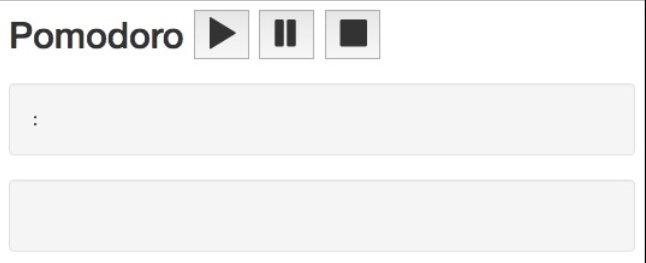

# 响应式 -- 为你的方程式绑定数据

在前一章， 你学习了 Vue.js 最重要的一个概念： 组件。 知道了如何你创建组件并注册、 调用、 重用组件
。 你理解了单文件组件并在购物清单和番茄钟方程式中应用。

在本章， 我们将深入数据绑定。 我们在前面已经讨论过它了， 你应该对它不再陌生了。 在我们的组件中你将使用所有可能的方式来绑定数据。

总结起来就是：
* 回顾数据绑定语法
* 在方程式里应用数据绑定
* 在相同的模板里用不同的数据来遍历数组并渲染单个元素
* 在我们的方程式中回顾并使用数据绑定和事件绑定简写方式

## 回顾数据绑定
在第一章我们已经讨论了数据绑定和响应式。 现在你已经了解了数据绑定就是从数据到视觉层的传播机制， 反之亦然。 在本章， 我们将在方程式中仔细复习所有的数据绑定方式。

## 启动数据

想象我们现在有以下 **HTML** 代码片段：

```
<div id="hello"></div>
```

同时还有如下 *JavaScript* 对象：

```
var data = {
  msg: 'Hello'
};
```

我们怎样在页面渲染所有数据呢？ 我们又是怎样在 **HTML** 内获取它们呢？ 事实上， 我们已经在前两章就解决了这两个问题了。 当然我们可以再来一次。

> "Repetitio est mater studiorum"

如果你已经对数据插值十分熟悉， 可以先跳过这部分直接到表达式和过滤器部分。

所以， 我们应该怎样在 div 标签内填充 *msg* 的值呢？ 如果我们用 jQuery 的老办法将是这样的：

```
$(".hello").text(data.msg);
```

但是， 如果你在方程式运行期间改变 *msg* 的值并期望改变传递给 DOM , 你必须手动更新。 简单改变 *data.msg* 的值， 什么都不会发生。

```
var data = {
  msg: 'Hello'
};
$("#hello").text(data.msg);
data.msg = 'Bye';
```

在 *<div>* 中将毫无疑问出现 *Hello*， 在 JSFiddle 查看效果 https://jsfiddle.net/chudaol/uevnd0e4/。

通过 Vue, 最简单的实现方式是使用 *{{}}*， 在我们的事例中， 我们这样写：

```
<div id="hello">{{ msg }}</div>
```

*<div>* 的内容尽管被绑定到了 *msg* 数据上， 当 *msg* 变化时， *div* 的内容会自动更新。 在 JSFiddle 查看效果  https://jsfiddle.net/chudaol/xuvqotmq/1/ 。 *data.msg* 也是随着 Vue 实例而变化的。 页面中的值将是一个新值。

这依旧是单向的数据绑定。 如果我们在 DOM 中改变值， 数据不会发生改变。 因此， 当我们值需要数据的值出现在 DOM 中时这将是完美的解决方案。

现在， 我们非常清楚地知道： 如果我们只想在模板内使用数据对象的值， 我们应该使用 *{{}}*。

我们来继续实现我们的番茄钟方程式。 请在[chapter4/pomodoro](https://github.com/PacktPublishing/Learning-Vue.js-2/tree/master/chapter4/pomodoro) 查看当前的解决方案。 如果你运行了 *npm run dev* 后，你的页面应该像这样：



实现我们的番茄钟

简单看一眼页面， 我们可以看出这里缺少什么。

页面中缺少时间， 小猫， 还有番茄钟的状态。 小猫出现的逻辑依靠与番茄钟的状态。 我们来为番茄钟增加状态和时间。

## 为番茄钟增加状态标题

首先， 我们应该确定这个元素应该属于哪个组件。 看看我们的四个组件。 很显然它属于 *StateTitleComponent* 组件。 查看下面代码， 它实际上已经实现了挑剔绑定：

```
//StateTitleComponent.vue
<template>
<h3>{{ title }}</h3>
</template>

<style scoped>
</style>

<script>
</script>
```

很好！ 在前面的章节里， 我们已经做了大部分工作。 现在我们只需为此增加必须的数据绑定。 在这个组件的 script 标签内， 我们来增加包含 *title* 特性的数据对象。 现在， 我们给它硬编码一个可能的值然后再决定怎么去改变它。 你想怎样改变呢？ *Work!* 还是 *Rest!* ？ 我知道答案， 我们来添加如下代码：

```
//StateTitleComponent.vue
<script>
export default {
  data () {
    return {
      title: 'Learning Vue.js!'
    }
  }
}
</script>
```

我们先就这样。 我们将在后面的 methods 和 event 控制中继续完善。

### 练习

用相同的方法为番茄钟增加事件， 可以先硬编码。

## 使用表达式和过滤器

在前面的事例中， 我们在 *{{}}* 中用了简单的属性键来插值。 事实上， Vue 在花括号里还有更多语法。 我们来看看。

## 表达式

超出意外， 但是 Vue 完全支持在花括号写表达式！ 我们来用任意一个番茄钟组件试试这些表达式。 你可以在这里查看一些实践 [chapter4/pomodoro2](https://github.com/PacktPublishing/Learning-Vuejs-2/tree/master/chapter4/pomodoro2) 。

随便在一个组件内尝试下， 例如 *StateTitleComponent.vue* 文件。 我们来添加一些 JavaScript 表达式：

```
{{ Math.pow(5, 2) }}
```

事实上， 你需要取消下面这些注释：

```
//StateTitleComponent.vue
<!--<p>-->
  <!--{{ Math.pow(5, 2) }}-->
<!--</p>-->
```

你将会在页面中看到 *25*。 好的。 我们用表达式来替换番茄钟内的一些简单数据绑定。 例如， 在 *CountdownComponent* 组件模板中， 两个指令， *min* 和 *sec* ，就可以被替换成一个表达式， 现在它是这样的：

```
//CountdownComponent.vue
<template>
  <div class="well">
    <div class="pomodoro-timer">
      <span>{{ min }}</span>:<span>{{ sec }}</span>
    </div>
  </div>
</template>
```

我们可以用下面的代码进行替换：

```
//CountdownComponent.vue
<template>
  <div class="well">
    <div class="pomodoro-timer">
      <span>{{ min + ':' + sec }}</span>
    </div>
  </div>
</template>
```

我们还可以在哪里加点表达式呢？ 我们再看看 *StateTitleComponent* 。现在， 我们需要硬编码标题。 我们知道， 但是， 标题依赖于番茄钟的状态。 如果是在 *working* 状态， 它将显示 **work!**， 否则应该显示 **Rest!**。 我们来创建一个叫 *isworking* 的特性， 把它分配在 App.vue 组件内， 因为它看起来更像是个全局方程式状态。 我们将重用 *StateTitleComponent* 组件的 *props* 特性。 因此， 打开 App.vue 为 *isworking* 添加一个布尔值， 设为真：

```
//App.vue
<...>
window.data = {
  kittens: true,
  isworking: true
};
export default {
  <...>
  data () {
    return window.data
    }
}
```

我们在 *StateTitleComponent* 中重用属性， 为每个可能的值增加两个字符串属性， 最后， 在模板内增加判断状态来渲染标题的表达式。 因此， 组件的脚本看起来是这样的：

```
//StateTitleComponent.vue
<script>
  export default {
    data () {
      return {
        workingtitle: 'Work!',
        restingtitle: 'Rest!'
      }
    },
    props: ['isworking']
  }
</script>
```

我们用 *isworking* 属性来有条件地渲染标题。 因此， *StateTitleComponent* 的模板是这样的：

```
<template>
  <div>
    <h3>
      {{ isworking ? workingtitle : restingtitle }}
    </h3>
  </div>
</template>
```

刷新页面。
