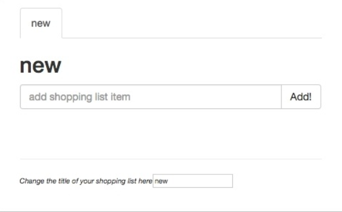
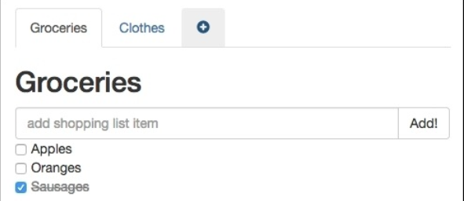
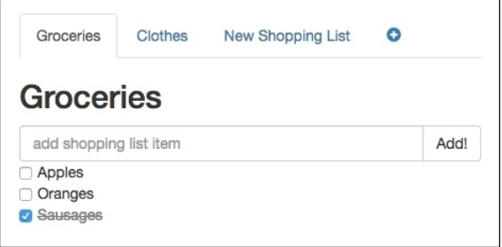
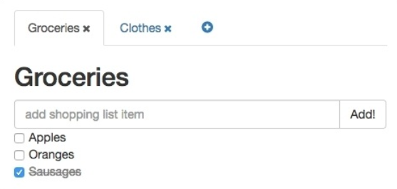
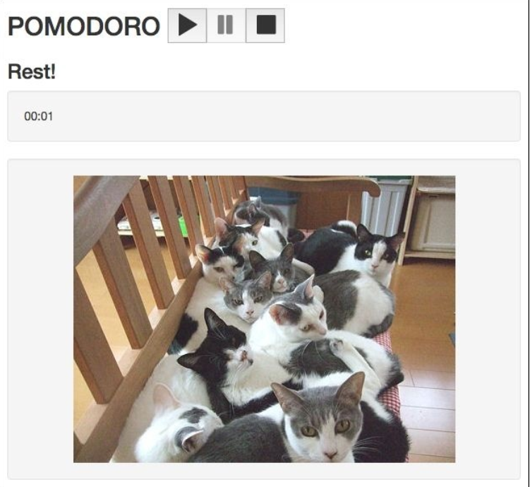

# Plugins – Building Your House with Your Own Bricks

在前面的章节里， 你已经学习了如何用 Vuex 架构来管理全局方程式仓库。 你学习了一堆新概念并应用了它们。 你也学习了如何去创建一个仓库， 如何定义它的状态和 mutations， 如何使用 actions 和 getters。 我们们学会的知识再次激活了我们的购物清单和番茄钟方程式。

在本章， 我们将回顾 Vue 插件， 看看它们是如何工作的， 为什么必须要创建插件。 我们将使用一些已有的插件并自己再创建一个。

总结起来呢， 就是一下几点：

* 理解 Vue 插件的本质
* 在购物清单方程式里使用 resource 插件
* 创建一个生成白， 粉， 棕的插件并在番茄钟内应用

## Vue 插件的本质

Vue 中的插件完全和用在任何作用域的插件一样： 添加功能， 也基于插件的本质， 去完成系统中一些核心不能完成的功能。 Vue 的插件可以提供不同的功能， 像定义一些 Vue 全局的方法甚至是实例方法， 提供新的指令， 过滤器，变换。

为了使用那些已有在插件， 首先你必须安装它：

**npm install some-plugin --save-dev**

然后， 告诉 Vue 你要在方程式内使用它：

```
var Vue = require('vue')
var SomePlugin = require('some-plugin')
```

**Vue.use(SomePlugin)**

我们也可以创建我们自己的插件。 很简单的。 你的插件必须提供一个 *install* 方法来定义一些或全局或实例的方法， 或者是一些自定义指令：

```
MyPlugin.install = function (Vue, options) {
  // 1. add global method or property
  Vue.myGlobalMethod = ...
  // 2. add a global asset
  Vue.directive('my-directive', {})
  // 3. add an instance method
  Vue.prototype.$myMethod = ...
}
```

然后就可以像使用其它插件一样使用了。 在本章， 我们将使用已有的 *resource* 插件并创建我们自己的插件。

## 在我们的购物清单方程式内使用 vue-resource 插件

打开我们的[购物清单方程式](https://github.com/PacktPublishing/Learning-Vuejs-2/tree/master/chapter6/shopping-list) 并运行 *npm install npm run dev*。 很棒， 但它依旧使用硬编码来建立购物清单。 如果我们想增删改查一些条目时使用 *resource* 插件会很方便， 这个插件允许我们创建简单的 REST 资源并调用 REST 方法。 在开始前， 我们来总结一下我们将需要做的工作：

* 首先， 我们需要一个简单的服务器来储存我们的购物清单。 后端提供所有需要的功能。
* 在创建完成服务及所有后端工作后， 我应该安装 *vue-resource* 插件来创建资源和行为来供后端调用。
* 为了保证数据的完整性， 我们应该在每次服务状态更新时执行一系列行为。
* 在方程式开始时， 我们应该从后端取得所有的购物清单数据并分配给我们的仓库。
* 我们应该提供一个机制来创建新的购物清单或删除已有的购物清单

听起来不难吧？ 开动起来！

## 创建一个简单的服务

为了足够简单， 我们将使用非常基本易用的 HTTP 服务， 用 JSON 文件来储存数据。 这个服务是 *json-server* 在https://github.com/typicode/json-server 。 把它安装在我们的方程式目录里：

**cd shopping-list**
**npm install --save-dev json-server**


创建一个叫 *db.json* 的服务器文件夹， 内容如下：

```
//shopping-list/server/db.json

{
  "shoppinglists": [
  ]
}
```

这将是我们的数据库。 我们在我们的 *package.json* 内添加一些脚本， 从而更容易地开始我们的服务：

```
"scripts": {
  "dev": "node build/dev-server.js ",
  "server": "node_modules/json-server/bin/index.js --watch
             server/db.json",
  <...>
},
```

现在， 启动服务， 按如下运行：

**cd shopping-list**
**npm run server**

在 http://localhost:3000/shoppinglists 打开浏览器。 你将看到一个空数组。 这是因为我们的数据库依然是空的。 我们试着用 curl 来添加一些数据：

**curl -H "Content-Type:application/json" -d '{"title":"new","items":[]}'**
**http://localhost:3000/shoppinglists**

如果你现在刷新页面， 你将看到新添加的值。

既然我们有了自己的 REST 服务。 那我们就在 *vue-resource* 的帮助下使用它吧！


## 安装 vue-resource, 创建 resource 和它的方法

在深入学习 *vue-reource* 之前， 查看它的文档  https://github.com/vuejs/vue-resource/blob/master/docs/resource.md。 文档提供了基于 URL 来简单创建 resources 的方法。 在 resource 被创建后， 我们可以对他进行 *get， delete, post update*。

在项目的文件夹内安装：

**cd shopping-list**
**npm install vue-resource --save-dev**

现在我们来为我们的端口创建 API 。 在 *src* 文件夹内， 创建一个叫 *api* 的二级文件夹。 在里面创建 *index.js* 文件， 导入 *vue-resource* 插件并告诉 *Vue* 来使用它：

```
//api/index.js
import Vue from 'vue'
import VueResource from 'vue-resource'

Vue.use(VueResource)
```

好的！现在我们来创建 *ShoppingListResource* 并在里面添加一些方法。 用 *vue-resource* 插件创建 resource , 我们只需要在 *Vue* 上调用 *resource* 方法并传入 URL 即可。

```
const ShoppingListsResource = Vue.resource('http://localhost:3000/' + 'shoppinglists{/id}')
```

*ShoppingListsResource* 常量现在暴露了我们所有需要的方法(CRUD)。  通过简单地暴露 resource 我们就可以完成。 但是我们需要为每个操作导出相应的方法：

```
export default {
  fetchShoppingLists: () => {
    return ShoppingListsResource.get()
  },
  addNewShoppingList: (data) => {
    return ShoppingListsResource.save(data)
  },
  updateShoppingList: (data) => {
    return ShoppingListsResource.update({ id: data.id }, data)
  },
  deleteShoppingList: (id) => {
    return ShoppingListsResource.remove({ id: id })
  }
}
```

*api/index.js* 完整的代码在 https://gist.github.com/chudaol/d5176b88ba2c5799c0b7b0dd33ac0426 。

就是这样！ 我们的 API 已经准备好了接收 Vue 的数据了！

## 从获取所有购物清单的数据开始

从创建一个获取 *shoppinglists* 状态的行为开始。 在它创建后， 我们在 *App.vue* 上调用。

在 *mutations_types.js* 内定义一个常量：

```
//mutation_types.js
export const POPULATE_SHOPPING_LISTS = 'POPULATE_SHOPPING_LISTS'
```

现在创建一个 mutation 。 这个 mutation 将只接收购物清单数组并分配给 *shoppinglists* 状态：

```
//mutations.js
export default {
  [types.CHANGE_TITLE] (state, data) {
    findById(state, data.id).title = data.title
  },
  [types.POPULATE_SHOPPING_LISTS] (state, lists) {
    state.shoppinglists = lists
  }
}
```

好的！ 现在我们只需要一个使用 API 方法来分发 mutation 的 action 了。 在 *actions.js* 文件内导入 API并创建相应的 action 方法：

```
import { CHANGE_TITLE, POPULATE_SHOPPING_LISTS } from './mutation_types'
import api from '../api'

export default {
  changeTitle: ({ commit }, data) => {
    commit(CHANGE_TITLE, data)
  },
  populateShoppingLists: ({ commit }) => {
    api.fetchShoppingLists().then(response => {
      commit(POPULATE_SHOPPING_LISTS, response.data)
    })
  }
}
```

在前面的代码里， 我们完成了一个简单的任务 -- 我们调用了 *fetchShoppingLists* API 方法， 反过来， 调用了 resource 的 *get* 方法。 这个方法产生一个 *http GET* 请求并当数据返回时完成一个 promise 。

数据将被用于分发填充 mutation 。 这个方法将为仓库状态属性 *shoppinglists* 分配数据。 这个属性是响应式的；  你还记得吗？
这意味着所有依赖 *shoppinglists* 属性的视图将被更新。 我们现在在 *App.vue* 组件内的 mounted 状态上使用 action。 更多关于 mounted 状态的钩子信息 https://vuejs.org/v2/api/#mounted 。

打开 *App.vue* 组件， 导入 *mapActions* 对象， 在组件的 *methods* 属性上映射 *populateShoppingLists* action， 在 *mounted* 控制器上调用。 所以我们的 *App.vue* 将会是这样的：

```
<script>
  import ShoppingListComponent from './components/ShoppingListComponent'
  import ShoppingListTitleComponent from
  './components/ShoppingListTitleComponent'
  import store from './vuex/store'
  import { mapGetters, mapActions } from 'vuex'

  export default {
    components: {
      ShoppingListComponent,
      ShoppingListTitleComponent
    },
    computed: mapGetters({
      shoppinglists: 'getLists'
    }),
    methods: mapActions(['populateShoppingLists']),
    store,
    mounted () {
      this.populateShoppingLists()
    }
  }
</script>
```

如果你现在打开页面， 会发现这里只有一个我们用 *curl* 创建的购物清单， 就像下图一样：



这里展示了由简单服务创建的购物清单！

试着用 *curl* 来插入更多的数据！

## 在变化上更新服务器状态

非常棒， 我们现在有了 REST API 服务， 一切正常运行。 试着添加一些购物清单或改变标题。 刷新页面。 哇哦， 列表空了！ 没错， 我们有一个 API 方法来更新给定的购物清单， 但是数据没有同步， 所以我们的服务器没有意识到变化。

我们来定义一个组件来让服务器接收更改。 下面的三件事将是我们要做的：

* 列表的标题可以在 *changeTitleComponent* 内改变
* 新的列表项可以在 *AddItemComponent* 内添加
* 购物清单的列表项可以在 *ItemComponent* 内切换

我们必须创建一个行为来触发所有的更改。 在这个行为内， 我们应该调用更新 API 的方法。 在 *api/index.js* 内查看 更新方法； 它必须接收整个购物清单对象为参数：

```
//api/index.js
updateShoppingList: (data) => {
  return ShoppingListsResource.update({ id: data.id }, data)
}
```

我们来创建一个行为来接收参数为 id ，通过 ID 来取回购物列表， 调用 API 方法。 在这么做之前，在 *getters.js* 内创建一个 *getListById* 方法并在 actions 内导入它：

```
//getters.js
import _ from 'underscore'
  export default {
    getLists: state => state.shoppinglists,
    getListById: (state, id) => {
      return  _.findWhere(state.shoppinglists, { id: id })
    }
}

//actions.js
import getters from './getters'
```

现在， 我们来调用更新购物清单的行为：

```
//actions.js
<...>

export default {
  <...>
  updateList: (store, id) => {
    let shoppingList = getters.getListById(store.state, id)
    api.updateShoppingList(shoppingList)
  }
}
```

事实上， 我们可以在 *mutations.js* 文件内删除 *findById* 方法了， 在 *getters.js* 内重用这个方法：

```
//mutations.js
import * as types from './mutation_types'
import getters from './getters'

export default {
  [types.CHANGE_TITLE] (state, data) {
    getters.getListById(state, data.id).title = data.title
  },
  [types.POPULATE_SHOPPING_LISTS] (state, lists) {
    state.shoppinglists = lists
  }
}
```

好的， 现在我们已经为 API 定义了调用 *updateList* 方法的行为了。 现在我们只需在组件内的每次变化时调用这个行为就可以了。

我们先修改 *AddItemComponent*。 我们必须在这里组件内用 *this.$store.dispatch* 方法分发 *updateList* 行为。 但是这里有个小问题 -- 我们必须把列表的 ID 传给 *updateList* 方法， 而且我们不能在这里组件里有它的引用。 但是呢， 这其实很好解决。 仅仅在组件的 *props* 添加 ID 并绑定给在组件上的调用行为。 我们的 *AddItemComponent* 组件看起来像这样：

```
//AddItemComponent.vue
<script>
  export default {
    props: ['id'],
    data () {
      return {
        newItem: ''
      }
    },
    methods: {
      addItem () {
        var text
        text = this.newItem.trim()
        if (text) {
          this.$emit('add', this.newItem)
          this.newItem = ''
          this.$store.dispatch('updateList', this.id)
        }
    }}
  }
</script>
```

在 *ShoppingListComponent* 内， 在 *add-item-component* 调用上绑定 ID：

```
//ShoppingListComponent.vue
<template>
  <...>
    <add-item-component :id="id" @add="addItem"></add-item-component>
  <...>
</template>
```

现在， 如果你试着添加列表项并刷新页面会发现添加的列表项还在！

现在， 我们应该给 *ChangeTitleComponent* 做相同的事。 打开 *ChangeTitleComponent.vue* 文件， 查看代码。 在 *changeTitle* action 上调用：

```
//ChangeTitleComponent.vue
<template>
  <div>
    <em>Change the title of your shopping list here</em>
    <input :value="title" @input="onInput({ title:
    $event.target.value, id: id })"/>
  </div>
</template>

<script>
import { mapActions } from 'vuex'

export default {
  props: ['title', 'id'],
  methods: mapActions({
    onInput: 'changeTitle'
  })
}
</script>
```

我们当然可以导入 *updateList* action 并在调用 *changeTitle* action 后调用。 但是， 在 action 内部操作会更简单。 你可能记得为了分发仓库的 action , 我们应该在仓库上以 action 的名字为参数调用 *dispatch* 方法。 所以我们在 *changeTitle* action 这么修改：

```
//actions.js
export default {
  changeTitle: (store, data) => {
    store.commit(CHANGE_TITLE, data)
    store.dispatch('updateList', data.id)
  },
  <...>
}
```

完成了， 打开页面， 修改标题， 刷新页面， 标题应该不变！

我们最后需要修改的是列表项的切换属性。 我们来看看 *ItemComponent* 并决定在哪里调用 *updateList* action。

我们从未 *props* 特性添加 ID 开始， 就像我们在 *AddItemComponent* 内做的一样：

```
//ItemComponent.vue
<script>
  export default {
    props: ['item', 'id']
  }
</script>
```

我们必须给组件的调用绑定 id 属性， 在 *ItemsComponent* 内完成：

```
//ItemsComponent.vue
<template>
  <ul>
    <item-component v-for="item in items" :item="item" :id="id">
    </item-component>
  </ul>
</template>

<script>
import ItemComponent from './ItemComponent'

export default {
  components: {
    ItemComponent
  },
  props: ['items', 'id']
}
</script>
```

这意味着我们必须为 *item-component* 绑定 id 属性：

```
//ShoppingListComponent.vue
<template>
  <...>
    <items-component :items="items" :id="id"></items-component>
  <...>
</template>
```

我们应该在 *ItemComponent* 导入 *mapActions* 对象并在 *methods* 属性上导出 *updateList* 方法：

```
//ItemComponent.vue
<script>
  import { mapActions } from 'vuex'
  export default {
    props: ['item', 'id'],
    methods: mapActions(['updateList'])
  }
</script>
```

很好， 万事俱备； 我们能仅需要在 *ItemComponent* 内找到调用 *updateList* 行为的地方就可以了。

这不是一个简单的任务， 因为不像在其它组件内我们有事件控制器来处理变更并调用相应的函数。 在这， 我们只有类和模型绑定给复选框元素。 幸运的是， Vue 提供了一个 *watch* 选项来为我们附加监视器到任意的组件数据上， 而且可以给它们绑定处理器。 在我们的例子中， 我们想监听 *item.checked* 属性并调用行为。 所以， 仅仅在组件上添加一个 *watch* 特性：

```
//ItemComponent.vue
<script>
  import { mapActions } from 'vuex'
  export default {
    props: ['item', 'id'],
    methods: mapActions(['updateList']),
    watch: {
      'item.checked': function () {
      this.updateList(this.id)
      }
    }
  }
</script>
```

我们完成了！ 试着添加清单列表， 切换， 刷新页面， 什么都不变！

## 创建一个新的购物清单

好的， 我们已经从服务器获取了购物清单； 我们也应用了数据变更。 但是， 如果我们在用户界面内直接创建购物清单那样的话会更棒。 当然， 我们能做到！

我们来增加几个行为来调用相应的 API 方法， 如下：

```
//actions.js
export default {
  <...>
  createShoppingList: ({ commit }, shoppinglist) => {
    api.addNewShoppingList(shoppinglist)
  }
}
```

现在我们提供了一种可视化操作。 我们在选项卡列表中通过 ＋ 操作来创建额外的选项卡， 我们用点击事件来实现。 我们将在 *App.vue* 组件中实现它。 我们已经导入了 *mapActions* 对象。 我们在 *methods* 属性上创建一个 *createShoppingList* 方法。

```
//App.vue
<script>
  import ShoppingListComponent from './components/ShoppingListComponent'
  import ShoppingListTitleComponent from
  './components/ShoppingListTitleComponent'
  import store from './vuex/store'
  import { mapGetters, mapActions } from 'vuex'

  export default {
    components: {
      ShoppingListComponent,
      ShoppingListTitleComponent
    },
    computed: mapGetters({
      shoppinglists: 'getLists'
    }),
    methods: mapActions(['populateShoppingLists',
    'createShoppingList']),
    store,
    mounted () {
      this.populateShoppingLists()
    }
  }
</script>
```

现在我们的 *App.vue* 组件已经可以访问 *createShoppingList* action, 还能再事件控制器上得到调用。 问题是哪个是数据？ *createShoppingList* 方法一直在等待接收一个发往服务器的数据。 我们来创建一个能生成新列表的方法， 在这个方法内调用 action。 但是这个方法该放在哪里呢？ 组件里的 *methods* 属性已经被 *mapActions* 辅助函数占用了。 好的， *mapActions* 方法返回方法的映射。 我们可以用本地方法来简单地扩展这个映射：

```
//App.vue
methods: _.extend({},
  mapActions(['populateShoppingLists', 'createShoppingList']),
  {
    addShoppingList () {
      let list = {
        title: 'New Shopping List',
        items: []
      }
    this.createShoppingList(list)
    }
  }),
```

现在我们仅仅需要添加一个按钮并绑定 *addShoppingList* 方法给它的点击事件。 你可以在页面的任意地方创建你自己的按钮。 我的按钮代码是这样的：

```
App.vue
<template>
  <div id="app" class="container">
    <ul class="nav nav-tabs" role="tablist">
      <li :class="index===0 ? 'active' : ''" v-for="(list, index) in
      shoppinglists" role="presentation">
      <shopping-list-title-component :id="list.id"
      :title="list.title"></shopping-list-title-component>
      </li>
      <li>
        <a href="#" @click="addShoppingList">
          <i class="glyphicon glyphicon-plus-sign"></i>
        </a>
      </li>
    </ul>

    <div class="tab-content">
      <div :class="index===0 ? 'active' : ''" v-for="(list, index) in
      shoppinglists" class="tab-pane" role="tabpanel" :id="list.id">
        <shopping-list-component :id="list.id" :title="list.title"
        :items="list.items"></shopping-list-component>
      </div>
    </div>
  </div>
</template>
```

查看页面； 在最后一个选项卡上你有了一个加号按钮， 它清晰地指引你来创建一个新的列表：



现在我们通过加号按钮来添加新的购物列表

试着点击按钮， 哇哦， 什么都没发生！ 但是如果你查看网络面板， 你可以看到刚刚产生的请求：


创建请求已经被成功执行了； 但是在这里却什么都没有发生。

实际上， 这已经成功了。 我们已经更新了服务器的信息， 但是客户端并没有意识到这个变化。 如果我们能在创建购物清单后填充清单就更好了。 当然啦， 我们可以。 回到 *actions.js* 并调用 *populateShoppingLists* action ：

```
//actions.js
createShoppingList: (store, shoppinglist) => {
  api.addNewShoppingList(shoppinglist).then(() => {
    store.dispatch('populateShoppingLists')
  })
}
```

现在， 如果你点击加号按钮， 你将立即看到刚创建的清单出现在选项卡面板里， 就像下图一样：



在填充列表后的新列表

你可以点击新列表， 改变标题， 添加列表项， 切换。 当你刷新页面后， 所有数据都将不变。 干得好！

## 删除已有的购物清单

我们已经能在创建更新我们的购物清单了。 现在我们需要删除它们。 在我们学习完本章的内容后， 你会认为这其实是最简单的一部分了。 我们应该在我们的 API 上添加一个 *deleteShoppingList* 方法， 为每个购物清单添加删除按钮， 并在上面调用 行为。

我们从添加这个行为开始。 很简单， 正如我们创建列表一样， 我们将在删除购物清单后调用 *populate* 方法， 我们的行为就像这样：

```
//action.js
deleteShoppingList: (store, id) => {
  api.deleteShoppingList(id).then(() => {
    store.dispatch('populateShoppingLists')
  })
}
```

现在让我们想想在哪加个删除按钮呢。 我更喜欢在选项卡的头部加上它。 这个组件叫 *ShoppingListTitleComponent* 。 打开它并导入 *mapActions* 辅助函数就像下面这样：

```
//ShoppingListTitleComponent.vue
<script>
import { mapActions } from 'vuex'

export default{
  props: ['id', 'title'],
  computed: {
    href () {
      return '#' + this.id
    }
  },
  methods: mapActions(['deleteShoppingList'])
}
</script>
```

现在我们来添加删除按钮并绑定 *deleteShoppingList* 方法给它的点击事件监听器。 我们将把 ID 传入这个方法中。 我们可以直接在模板内这样做：

```
//ShoppingListTitleComponent.vue
<template>
  <a :href="href" :aria-controls="id" role="tab" data-toggle="tab">
    {{ title }}
    <i class="glyphicon glyphicon-remove"
    @click="deleteShoppingList(id)"></i>
  </a>
</template>
```

我也添加了一点点标题的样式让它看起来更棒：

```
<style scoped>
i {
  font-size: x-small;
  padding-left: 3px;
  cursor: pointer;
}
</style>
```

就是这样！ 打开页面你在购物列表标题旁边看到一个 X 按钮。 试着点击它你将立即看到变化， 正如下图：



有了删除按钮的购物清单列表

恭喜你哦！ 我们现在已经有了功能完备的方程式， 我们可以创建， 删除购物清单并改变列表项！ 干得好！ 最终代码在 [ chapter6/shopping-list2](https://github.com/PacktPublishing/Learning-Vuejs-2/tree/master/chapter6/shopping-list2) 。

### 练习

我们的每个购物清单都挺像的。 你能加点样式来区分它们吗。

## 在番茄钟方程式内创建使用插件

现在我们已经知道如何使用已有的插件了， 我们为什么不自己制作一个呢？ 我们番茄钟方程式已经有了一些动画， 页面也将在番茄钟切换状态时发生变化。 但是如果我们不查看选项卡， 我们分不清它到底是不是在运行。 我们来为我们的番茄钟方程式加点声音！

在考虑为一款时间管理方程式加点声音时， 我更想想想对工作有益的声音。 我们每个人都有自己最爱的工作列表播放录。 当然， 这取决于每个人的音乐爱好。 这就是我为什么决定要给我们的方程式添加一些自然的音响的原因。 研究指出不同的声音与高强度的工作很配。 可以在维基  https://en.wikipedia.org/wiki/Sound_masking 了解。 Quora 也有些讨论  http://bit.ly/2cmRVW2 。

在这部分， 我们将使用 Web Audio API ( https://developer.mozilla.org/enUS/docs/Web/API/Web_Audio_API ) 来创建 Vue 的插件生成 白， 粉， 棕的声音。 我们将提供一种声音的事例。 我们也提供全局的 Vue 方法来开始暂停这些声音。 然后， 我们将使用这个插件在休息时切换到沉默状态， 工作时切换为声音状态。 听起来有趣又有挑战吧？ 我希望如此！ 我们开始吧！

## 创建一个声音生成器插件

我们的插件可以存储到单个 JavaScript 文件内。 它将包含三个方法， 一个用于生成每种声音并提供 *Vue.install* 方法来安装。 我们使用 [ chapter6/pomodoro ](https://github.com/PacktPublishing/Learning-Vue.js-2/tree/master/chapter6/pomodoro ) 文件夹作为起点。 在 *src* 文件夹下创建一个插件二级文件夹。 添加 *VueNoiseGeneratorPlugin.js* 文件。 现在创建下面三个方法：

* generateWhiteNoise
* generatePinkNoise
* generateBrownNoise

我不再造轮子了我将复制粘贴我在网上找到的代码。 当然我对这些代码非常感谢 http://noisehack.com/generate-noise-web-audio-api/ 。 正如所说的， 我们的插件就像下面这样组织：

```
// plugins/VueNoiseGenerator.js
import _ from 'underscore'
// Thanks to this great tutorial:
//http://noisehack.com/generate-noise-web-audio-api/

var audioContext, bufferSize, noise
audioContext = new (window.AudioContext || window.webkitAudioContext)()

function generateWhiteNoise () {
  var noiseBuffer, output
  bufferSize = 2 * audioContext.sampleRate
  noiseBuffer = audioContext.createBuffer(1, bufferSize, audioContext.sampleRate)

  output = noiseBuffer.getChannelData(0)

  _.times(bufferSize, i => {
    output[i] = Math.random() * 2 - 1
  })
  noise = audioContext.createBufferSource()
  noise.buffer = noiseBuffer
  noise.loop = true
  noise.start(0)
  return noise
}

function generatePinkNoise () {
  bufferSize = 4096
  noise = (function () {
  var b0, b1, b2, b3, b4, b5, b6, node
  b0 = b1 = b2 = b3 = b4 = b5 = b6 = 0.0
  node = audioContext.createScriptProcessor(bufferSize, 1, 1)
  node.onaudioprocess = function (e) {
    var outputoutput = e.outputBuffer.getChannelData(0)
    _.times(bufferSize, i => {
      var white = Math.random() * 2 - 1
      b0 = 0.99886 * b0 + white * 0.0555179
      b1 = 0.99332 * b1 + white * 0.0750759
      b2 = 0.96900 * b2 + white * 0.1538520
      b3 = 0.86650 * b3 + white * 0.3104856
      b4 = 0.55000 * b4 + white * 0.5329522
      b5 = -0.7616 * b5 - white * 0.0168980
      output[i] = b0 + b1 + b2 + b3 + b4 + b5 + b6 + white * 0.5362
      output[i] *= 0.11 // (roughly) compensate for gain
      b6 = white * 0.115926
    })
  }
  return node
  })()
  return noise
}

function generateBrownNoise () {
  bufferSize = 4096
  noise = (function () {
    var lastOut, node
    lastOut = 0.0
    node = audioContext.createScriptProcessor(bufferSize, 1, 1)
    node.onaudioprocess = function (e) {
      var output = e.outputBuffer.getChannelData(0)
      _.times(bufferSize, i => {
        var white = Math.random() * 2 - 1
        output[i] = (lastOut + (0.02 * white)) / 1.02
        lastOut = output[i]
        output[i] *= 3.5
        // (roughly) compensate for gain
      })
    }
    return node
  })()
  return noise
}
```

你可以在 JSFiddle https://jsfiddle.net/chudaol/7tuewm5z/  听到所有的声音。

现在， 我们实现了这三种声音了。 我们必须导出 *install* 方法。 这个方法接收 Vue 实例， 然后我们可以在上面创建指令和方法。 我们创建一个 *noise* 指令。 这个指令可以有三个值， *white, pink, brown* 。 通过相应声音的创建方法来调用。 我们的 *install* 方法如下：

```
// plugins/VueNoiseGeneratorPlugin.jsexport
default {
  install: function (Vue) {
    Vue.directive('noise', (value) => {
      var noise
      switch (value) {
        case 'white':
          noise = generateWhiteNoise()
          break
        case 'pink':
          noise = generatePinkNoise()
          break
        case 'brown':
          noise = generateBrownNoise()
          break
        default:
          noise = generateWhiteNoise()
      }
      noise.connect(audioContext.destination)
      audioContext.suspend()
    })
  }
}
```

安装后， 我们实例化 *audioContext* 并挂起它， 因为我们可不想一开始就产生这些声音。 我们需要在一些事件上实例化它们(例如，开始按钮, 暂停按钮之类的)。 我们提供方法来开始， 暂停， 停止我们的 *audioContext* 。 我们将把这三个方法包装成一个叫 *noise* 的全局 Vue 属性。 我们把这些方法命名为 *start, pause, stop*。 在 *start* 方法内， 我们要开始 *audioContext* ， 在 *pause* 和 *stop* 方法上挂起它。 所以， 我们的方法看起来就像下面这样：

```
// plugins/VueNoiseGeneratorPlugin.js

export default {
  install: function (Vue) {
    Vue.directive('noise', (value) => {
      <...>
    })
    Vue.noise = {
      start () {
        audioContext.resume()
      },
      pause () {
        audioContext.suspend()
      },
      stop () {
        audioContext.suspend()
      }
    }
  }
}
```

就是这样！ 我们的插件完全可用了， 它不是很完美， 当然， 因为我们只有一个 *audioContext* ， 它只被一次实例化并只有一种声音， 这意味着我们将不能多次使用 *noise* 指令。 但是呢， 这只是个原型， 你完全可以在后续完善它！

## 在番茄钟内使用插件

首先， 我们有一个声音生成器插件， 就差使用了！ 你已经知道如何来使用它额。 打开 *main.js* 文件， 导入 *VueNoiseGeneratorPlugin* ， 并告诉 Vue 来使用它：

```
import VueNoiseGeneratorPlugin from
'./plugins/VueNoiseGeneratorPlugin'

Vue.use(VueNoiseGeneratorPlugin)
```

然后， 我们可以添加 *noise* 指令并在番茄钟内任意地使用 *Vue.noise* 方法。 我们绑定给 *App.vue* 组件内的主模板：

```
//App.vue
<template>
  <div id="app" class="container" v-noise="'brown'">
    <...>
  </div>
</template>
```

注意我们使用了 *v-noise* 名字的指令， 而非 *noise*。 我们已经在自定义指令时讨论过它了。 在使用指令时， 给它的名字加上 *v-* 前缀。 也请注意， 我们在单引号包围的 *brown* 字符串后又用了双引号。 如果不这样做， Vue 将搜索 *brown* 数据属性， 这就是 Vue 的工作。 我们可以在指令内写任何 JavaScript 语句绑定任务， 我们必须在双引号内传入。 你可以创建操作 *noise* 数据属性并分配给你想要分配的值， 在指令绑定语法内重用。

然后， 我们在 *start* mutation 内调用 *Vue.noise.start* 方法：

```
//mutations.js
import Vue from 'vue'
<...>
export default {
  [types.START] (state) {
    <...>
    if (state.isWorking) {
      Vue.noise.start()
    }
  },
<...>
```

查看页面并点击 start 按钮。 你将听到 brown 声音。  小心千万别吵醒你的同事也别吓到你的家人。 试着改变声音的值。

剩下就是你还没有做的。 我们创建了声音开始但无法停止的机制。 我们在 *pause* 和 *stop* mutations 上调用 *Vue.noise.pause* 和 *Vue.noise.stop* 方法：

```
//mutations.js
export default {
  <...>
  [types.PAUSE] (state) {
    <...>
    Vue.noise.pause()
  },
  [types.STOP] (state) {
    <...>
    Vue.noise.stop()
  }
}
```

查看页面。 点击暂停或停止按钮， 声音被挂起了！ 我们还什么都没做呢。 记得我们的目的是在工作时有声音而不是在休息时。 所以， 我们看看再 *mutations.js* 文件内的 *togglePomodoro* 方法并添加一个通过番茄钟当前状态来开始暂停声音的机制：

```
//mutations.js
function togglePomodoro (state, toggle) {
  if (_.isBoolean(toggle) === false) {
    toggle = !state.isWorking
  }

  state.isWorking = toggle
  if (state.isWorking) {
    Vue.noise.start()
  } else {
    Vue.noise.pause()
  }
  state.counter = state.isWorking ? WORKING_TIME : RESTING_TIME
}
```

番茄钟的代码可以在这里查看[chapter6/pomodoro2](https://github.com/PacktPublishing/Learning-Vue.js-2/tree/master/chapter6/pomodoro2) 文件夹。

## 创建一个按钮切换声音

为声音绑定番茄钟的状态很棒。 当暂停方程式时声音也停止很棒。 但是， 在方程式运行时停止声音也很有用。 想到这些应用场景， 甚至是在方程式运行时拨打 Skype 电话。 在这些情况下， 在这类场景下， 有个声音背景可一点也不好。 我们添加一个按钮来切换声音。 以声明一个 *soundEnabled* 仓库属性并初始为 *true* 为起始点。 为这个属性创建 *getter* 。 所以看起来是这样的：

```
//store.js
<...>
const state = {
  <...>
  soundEnabled: true
}

 //getters.js

export default {
  <...>
  isSoundEnabled: state => state.soundEnabled
}
```

现在我们必须提供一种机制来切换声音。 我们来为它创建 mutation 方法并添加分发这个 muation 的 action。 以声明 TOGGLE_SOUND 为 mutation 类型开始：

```
//mutation_types.js
<...>
export const TOGGLE_SOUND = 'TOGGLE_SOUND'
```

现在打开 *mutations.js* 添加 mutation 方法切换 *soundEnabled* 仓库属性：

```
//mutations.js
[types.TOGGLE_SOUND] (state) {
  state.soundEnabled = !state.soundEnabled
  if (state.soundEnabled) {
    Vue.noise.start()
  } else {
    Vue.noise.pause()
  }
}
```

现在我们添加分发这个 mutation 的 action：

```
//actions.js
export default {
  <...>
  toggleSound: ({ commit }) => {
    commit(types.TOGGLE_SOUND)
  }
}
```

现在， 我们创建了所有需要的按钮！ 我们在 *ControlsComponent*  完成它。 给 methods 映射添加一个 *getter* 和 *action* ：

```
//ControlsComponent.vue
<script>
  import { mapGetters, mapActions } from 'vuex'

  export default {
  computed: mapGetters(['isStarted', 'isPaused', 'isStopped', 'isSoundEnabled']),
  methods: mapActions(['start', 'stop', 'pause', 'toggleSound'])
  }
</script>
```

现在我们能给模板添加一个按钮。 我建议以一个 *glyphicon* 类的标致替代。

我们只在方程式开始并未暂停时显示这个标志， 只有番茄钟的状态是 *working* 时显示， 这样我们就不会弄乱切换状态了。 这意味着我们需要 *v-show* 指令：

```
v-show="isStarted && !isPaused && isWorking"
```

注意我们在这里使用 *isWorking* 属性， 它还没被导入呢。 把它加入到方法映射里：

```
//ControlsComponents.vue
<script>
  import { mapGetters, mapActions } from 'vuex'

  export default {
  computed: mapGetters(['isStarted', 'isPaused', 'isStopped', 'isWorking', 'isSoundEnabled']),
  methods: mapActions(['start', 'stop', 'pause', 'toggleSound'])
  }
</script>
```

在这个元素上我们也使用 *glyphicon-volume-off* 和 *glyphicon-volume-on*  类。 它们将指明声音切换动作状态。 *glyphicon-volume-off* 类将在有声音时，  *glyphicon-volume-on* 类将在么声音时。 代码里这样写：

```
:class="{ 'glyphicon-volume-off': isSoundEnabled, 'glyphicon-volume-up': !isSoundEnabled }"
```

还有一点重要的是， 我们应该在按钮被点击时调用 *toggleSound* 。 就是说我们应该给这个元素绑定点击事件：

```
@click='toggleSound'
```

所以呢， 整个代码看起来像这样：

```
//ControlsComponent.vue
<template>
  <span>
    <...>
    <i class="toggle-volume glyphicon" v-show="isStarted &&
    !isPaused && isWorking" :class="{ 'glyphicon-volume-off':
    isSoundEnabled, 'glyphicon-volume-up': !isSoundEnabled }"
    @click="toggleSound"></i>
  </span>
</template>
```

我们为这个按钮再加一点样式：

```
<style scoped>
  <...>
  .toggle-volume {
    float: right;
    cursor: pointer;
  }
</style>
```


打开页面点击开启番茄钟。 你可以看到右上角的按钮， 你可以点击它来切换声音：


现在我们可以在番茄钟运行时关闭声音了！

如果你点击这个按钮， 它将变成另一个按钮：


我们可以切换它

现在想象有下面的场景： 我们启动方程式， 关闭声音， 暂停方程式， 重启方程式。 我们的当前逻辑是声音在每次方程式启动时开启。 我们将处于一种不一样的状态中 -- 方程式已经启动， 声音开始， 但是声音切换键显示要开启声音， 好像不对吧？ 但是这很好解决 -- 仅仅添加一个条件来开启 muation 而不是检查 *isworking* 状态：

```
//mutations.js
[types.START](state) {
  <...>
  if (state.isWorking && state.soundEnabled) {
    Vue.noise.start()
  }
},
```

完整版的代码在[chapter6/pomodoro3](https://github.com/PacktPublishing/Learning-Vue.js-2/tree/master/chapter6/pomodoro3) 文件夹。

## 练习

如果在番茄钟休息时也能有点音乐就好了， 创建一个在番茄钟休息时播放的音乐的插件。

## 总结

我在写最后一点代码时就被这张图片迷住了：



一大群猫咪好像在问我： 这章什么时候结束？

在本章， 你学习了插件系统如何工作。 我们使用了已有的 *resource* 插件来给哦我们的购物清单添加服务端行为。 现在我们能创建， 删除， 更新我们的鼓舞清单了。

我们也创建了我们自己的插件！ 我们的插件可以产生声音来帮助我们在工作时集中精神。 我们不仅创建了它， 而且还在我们的番茄钟方程式内应用了它！ 现在我们可以在番茄钟工作时更加集中精神了！

现在我们手边有两个真正的方程式了。 你知道什么才是更好的方程式吗？

让方程式变得更好的方法是测试我们方程式！

记住， 我们要开始测试我们的方程式了。 下一章， 我们将深入一些测试技术。 我们将用 Karms 写一些单元测试， 用 Jasmine 为断言库。 我们将用 Nightwatch 写端对端测试。 我喜欢测试方程式也希望你喜欢。 出发！
